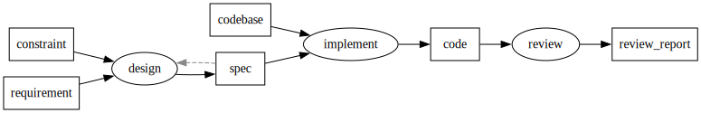

# PFDSL — Process Flow DSL

A small DSL for describing process flows as artifacts and processes, and
the input/output edges between them. Sources
parse to a canonical edge list that can be re-emitted, validated, diffed,
and rendered to Graphviz (DOT or SVG).

```pfdsl
[requirement, constraint] >> design -> spec
spec >>? design                       # feedback loop
[spec, codebase] >> implement -> code
code >> review -> review_report
```



## Spec

Language specification: [docs/spec/spec.md](docs/spec/spec.md)

Key syntax:
- `A >> P -> B` — A is input to process P, B is output of P
- `[a, b] >> P` — set notation (Cartesian product over edges)
- `R >>? P` — feedback edge (does not affect rank/topology)
- `A >> P -> B >> Q -> C` — chain (multi-segment statement)
- `# ...` — comment to end of line
- Trailing tokens (`<id>` or `]`) may be followed by a single newline (and
  optional comment lines) before a continuation operator (`>>`, `>>?`,
  `->`); blank lines force statement termination.

## Artifact status & tags (DOT styling)

Annotate artifacts with progress `status` (enum) and free-form `tags`,
then map them to DOT node attributes via frontmatter.

```pfdsl
---
artifact:
  spec:
    status: done
    tags: [external, critical]
  impl:
    status: wip
statusStyles:
  done: { fillcolor: lightgray, style: filled }
  wip:  { fillcolor: lightyellow, style: filled }
tagStyles:
  external: { color: blue }
  critical: { penwidth: "3" }
---
spec >> P -> impl
```

- `status` ∈ `done | wip | todo | blocked` (one per artifact)
- `tags` — arbitrary string array; undefined entries in `tagStyles` are silently ignored
- Allowed style attrs: `fillcolor | color | fontcolor | style | penwidth`
- Apply order: `tags` reverse-merge (first tag wins) → `statusStyles` overrides last
- Applies to artifact nodes only

See [docs/spec/spec.md §2.7](docs/spec/spec.md) for full rules.

## Samples

Feature-by-feature syntax examples with rendered `.dot` and `.svg`: [docs/samples/](docs/samples/README.md).

## Features

- **Pipeline** — lexer → parser → normalizer → validator → canonical sorter → formatter (`@pfdsl/core`)
- **DOT / SVG** — Graphviz export and Wasm-based rendering (`@pfdsl/graphviz-exporter`, `@pfdsl/preview-engine`)
- **CLI** — `pfdsl check / fmt / normalize / graph / diff` (`@pfdsl/cli`)
- **VSCode extension** — syntax highlighting, diagnostics, hover, document formatter, live SVG preview (`@pfdsl/vscode-extension`)
- **Claude Code skill** — syntax reference, CLI guidance, workflow for editing `.pfdsl` files (`.claude/skills/pfdsl/`)

Roadmap progress lives in [docs/pfdsl_implementation_flow.pfdsl](docs/pfdsl_implementation_flow.pfdsl) (written in PFDSL itself).

## Quick start

```bash
pnpm install
pnpm -r build
pnpm -r test       # 128 tests across 4 packages
pnpm -r typecheck
```

## CLI

After `pnpm -r build`, run the CLI in one of these ways:

```bash
# Run directly (no install):
node packages/cli/dist/cli.js help

# Or add a shell alias (recommended for daily use):
echo "alias pfdsl='node $PWD/packages/cli/dist/cli.js'" >> ~/.zshrc
source ~/.zshrc
```

> Note: `pnpm link --global` from this workspace links the root package
> (named `pfdsl`) instead of `@pfdsl/cli`, so it does not expose the
> binary. Use the alias above, or rename the root package, if you want
> a global `pfdsl` command via pnpm.

```bash
pfdsl check <file>                    # validate
pfdsl fmt <file> [--write]            # format (stdout, or rewrite in place)
pfdsl normalize <file>                # canonical edge list
pfdsl graph <file> [--format dot|svg] # Graphviz DOT (default) or SVG
pfdsl diff <a> <b>                    # structural diff (nodes / edges / feedback)
pfdsl help
```

Exit codes: `0` ok, `1` validation/IO error, `2` usage error.

## VSCode extension

See [packages/vscode-extension/README.md](packages/vscode-extension/README.md) for full feature docs.

```bash
pnpm --filter @pfdsl/vscode-extension build
```

Open the repo in VS Code and press `F5` to launch an Extension Development
Host with `@pfdsl/vscode-extension` loaded. In the host, `.pfdsl` files get:

- syntax highlighting (TextMate grammar; YAML embedded in frontmatter)
- inline diagnostics (parse / normalize / validate)
- hover metadata for artifacts and processes (label, owner, status, tags, parts)
- `Format Document` / `pfdsl.format`
- `PFDSL: Open Preview to the Side` (`pfdsl.preview`) — live SVG, refreshes on edit

## Claude Code skill

A skill for Claude Code is bundled at `.claude/skills/pfdsl/`. It provides PFDSL syntax reference, CLI command guidance, and workflow steps for editing `.pfdsl` files. Claude Code picks it up automatically when working in this repo.

To regenerate after spec or sample changes:

```bash
make gen-skill
# or install elsewhere:
node scripts/gen-skill.mjs --out ~/.claude/skills/pfdsl
```

The `--out` path must contain `/.claude/` (safety check). The script copies `docs/spec/spec.md` and `docs/samples/` into `references/` alongside `SKILL.md`.

## Library

```ts
import { format } from '@pfdsl/core';

const { output, diagnostics } = format(`
[a, b] >> proc -> result
result >>? proc
`);

console.log(output);
// a >> proc
// b >> proc
// result >>? proc
// proc -> result
```

One-shot pipeline (parse + normalize + validate + buildGraph) and SVG render:

```ts
import { analyze } from '@pfdsl/core';
import { renderGraph } from '@pfdsl/preview-engine';

const { graph, frontmatter, diagnostics } = analyze(source);
if (diagnostics.some(d => d.severity === 'error')) throw new Error('invalid source');
const svg = await renderGraph(graph, frontmatter, { format: 'svg' });
```

API reference: [packages/core/README.md](packages/core/README.md).

## Repo layout

```
packages/core/               @pfdsl/core              — DSL pipeline (parse / validate / format)
packages/graphviz-exporter/  @pfdsl/graphviz-exporter — Graph → DOT
packages/preview-engine/     @pfdsl/preview-engine    — DOT → SVG (Graphviz wasm)
packages/cli/                @pfdsl/cli               — `pfdsl` CLI
packages/vscode-extension/   @pfdsl/vscode-extension  — VSCode language extension ([README](packages/vscode-extension/README.md))
docs/spec/                   Language specification (spec.md)
docs/samples/                Syntax samples — .pfdsl + .dot + .svg pairs
docs/                        ADRs, plans, roadmap
```
