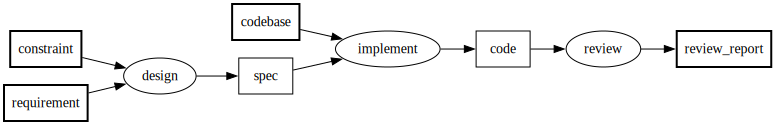
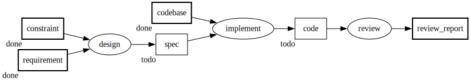

# PFDをテキストDSLにして処理系に載せる（PFDSL 連載 第1部）

プロジェクトの進め方（誰が何を作り、何に依存して完了するか）が暗黙知のままだと、人もAIも、毎回誰かに文脈を説明してもらわないと参加できない。
プロセスを成果物依存グラフとしてテキストに外化し機械検査に載せれば、文脈ゼロの参加者が図を読むだけで作業を選び、回し、監査できる。
PFDSLはそのための言語と運用である。

連載は5部構成で、各部が言語設計の1つの層を扱う。
第1部「PFDをテキストDSLにして処理系に載せる」。
第2部「グラフに入れた制約、入れなかった機能」。
第3部「メタデータで図を運用につなぐ」。
第4部「運用そのものをPFDに書く」。
第5部「実行と振り返りで運用を直し続ける」。

## 既存のタスク管理が持つ二つの弱点

書き捨てで終わらないプロジェクトには、ほぼ必ず依存関係が生まれる。
ある資料は別の資料の合意を前提にしているし、ある実装はある仕様が固まらないと始められない。
これは開発だけの話ではなく、企画もデザインも法務のレビューも、成果物同士が互いを前提にし合う点では同じ構造を持つ。

この依存関係の管理には、二つの別々の弱点がある。

一つ目は、既存のタスク管理が依存関係を第一級で表現できないことだ。
ToDoリストはフラットな項目の並びで、項目同士の前後関係を持たない。
「これが済んだらあれができる」という関係を書く場所がなく、その関係は書いた人の頭の中にしか残らない。

WBS（作業分解構成図）は成果物を主語にする点でToDoリストより一歩進んでいるが、木構造は包含関係を表すためのものだ。
「AはBの一部である」は書けても「AからBを作る」という生成の関係は書けない。
この弱点は現場でも広く了解されていて、実務ではWBSをガントチャートへ変換して実行順を補う。
だがその変換はほとんどの場合暗黙に行われ、どの依存関係がどの前後関係を根拠にしているかという対応がガントチャートには残らない。
しかも成果物間の依存だけからは実行順が複数通りありうるのに、ガントチャートは1本の実行順に収束させ、他の並べ方も正当だったという事実を覆い隠す。

DFD（データフロー図）はデータの流れを書く図法で、データストアや状態の更新を扱う点では依存関係に近い語彙を持つ。
ただしDFDが表現するのはシステムが処理するデータの流れであって、作業の完了や着手可否を管理するための図ではない。

どの手法も着手可否の判断には力不足である理由は共通している。
「成果物」と「何から何を作るか」という生成の依存を、第一級の要素として持っていないことだ。
持っているのは項目の並びだったり、包含の木だったり、データの流れだったりする。
どれも依存関係そのものを主役に据えていない。

二つ目は、依存関係の絵そのものは作図ツールで描けるが、その図が腐ることだ。
現実の進捗が変わるたびに絵を描き直す手間が要り、その手間は後回しにされがちになる。
更新が止まった図は実体との乖離が広がり、乖離が広がった図は当てにならないと見なされて参照されなくなる。
参照されない図は誰にも直されないまま放置される。

一つ目は表現力の欠如であり、二つ目は維持の失敗である。
どちらも別の弱点であり、片方を直しても残る。

## 成果物を主語にした依存グラフをテキストで書く

一つ目の弱点への対処は、作業（プロセス）ではなく成果物を主語にして進行を書くことから始まる。
「設計をしている」ではなく「仕様書ができた」を単位にすると、何を生んで完了したかが検証可能になる。
これは清水吉男が派生開発手法XDDPのために考案したPFD（Process Flow Diagram）の核であり、PFDは成果物とそれを生成するプロセスの依存関係を明示的に書く図法である[^shimizu]。

PFDSLはこの図法をテキストで書くための最小限の記法を持つ。

- `A >> P -> B`：AはプロセスPの入力、BはPの出力。
- `[a, b] >> P`：集合記法。
- 図の冒頭に置くメタデータ欄（frontmatter）で、ノードに表示名（label）を、成果物にstatus（done / wip / todoなど）を付けられる。

要件と制約から設計を経て仕様書ができ、それをもとに実装してコードができ、コードをレビューしてレビュー結果ができる、という流れは次のように書ける。

```pfdsl
---
artifact:
  requirement:
    label: 要件
  constraint:
    label: 制約
  spec:
    label: 仕様書
  codebase:
    label: 既存コード
  code:
    label: コード
  review_report:
    label: レビュー結果
process:
  design:
    label: 設計
  implement:
    label: 実装
  review:
    label: レビュー
---
[requirement, constraint] >> design -> spec
[spec, codebase] >> implement -> code
code >> review -> review_report
```

このテキストは、CLIひとつでレイアウト済みの絵に変換できる。
以降に載せる図の絵は、すべて本文中のテキストからこの変換で生成したものである。



矢印の向きが依存の向きそのものであり、図を上から読むだけで誰が何を待っているかが分かる。
この図には作業の進め方や担当者は一切書かれていない。
書かれているのは成果物と、それを生む依存関係だけだ。
それで十分なのは、次に何ができるかを決めるのに必要なのが誰が今忙しいかではなく何が揃っているかだからである。

## 次に着手できる作業を機械で導出する

成果物にstatusを付けると、この図から次に着手できる作業が導出できるようになる。
規則は単純で、入力となる成果物が全てdoneのプロセスが、今着手できる作業である。

先ほどの図に進捗を足してみる。

```pfdsl
---
artifact:
  requirement:
    label: 要件
    status: done
  constraint:
    label: 制約
    status: done
  spec:
    label: 仕様書
    status: todo
  codebase:
    label: 既存コード
    status: done
  code:
    label: コード
    status: todo
  review_report:
    label: レビュー結果
process:
  design:
    label: 設計
  implement:
    label: 実装
  review:
    label: レビュー
---
[requirement, constraint] >> design -> spec
[spec, codebase] >> implement -> code
code >> review -> review_report
```



designの入力はrequirementとconstraintで、どちらもdoneなのでdesignには今着手できる。
implementの入力はspecとcodebaseだが、specがまだtodoなのでimplementはまだ着手できない。
reviewの入力はcodeで、これもtodoのままなので同様にまだ着手できない。

この列挙は機械的な規則の適用でしかない。
人が目で追っても、スクリプトが走査しても、文脈を持たないAIエージェントが読んでも、同じ結論に到達する。
判断の材料が個人の記憶ではなく図とstatusという外部データになっているからだ。
誰がやっても同じ答えになるということは、答えを出すために背景の共有が要らないということでもある。
図とstatusさえ渡せば、その場に居合わせていなかった人にも同じ**着手可能集合**が見える。

この導出は実際にコマンドとして機械化されている。
先ほどの図に、これが進行管理の図（roadmap）であるという種別の宣言を1行足してCLIに渡すと、着手できるプロセスの一覧が返る。

```
$ pfdsl ready roadmap.pfdsl --best
Ready processes (1):
  * design               "設計"   inputs: [requirement, constraint]

* = recommended next (removes the last blocker for the most downstream processes)
```

着手できるのはdesignの1つで、`*`はその中の推薦を示す。
候補が複数あるときは、後続プロセスに残された最後の未完入力を作るプロセス、つまり完了すれば後続の待ちが解けるものに推薦が付く。
どれを先にやるかという優先順位の議論の一部まで、グラフの形から機械的に決まる。
図の種別の宣言については第4部で扱う。

オープンなissueが8件たまったリポジトリで、優先順位を付ける場面を考えよう。
issueとその依存関係をPFDとして書き起こせば、入力が全てdoneのプロセスの列挙、つまり並列で着手できる作業のリストがstatusから機械的に導出できる。
8件のissueが9本の並列作業に分解される、といった答えが即座に出る。
issueを一つずつ読み比べて、依存を頭の中で組み立て直す必要はない。

新しい提案の影響評価も同じ形になる。
仕様に新しいメタデータを追加する提案が来たとしよう。
既存の依存グラフに1本のチェーンを追加するだけで、いくつかのことが確定する。
その提案は仕様の他の起草作業と並列に進められること。
既存方針との接点は1箇所だけであること。
最終的な合流点は仕様を1つにまとめる統合プロセスであること。
文章の進行管理文書だけを頼りにしていたら、これらは提案が来るたびに頭の中でやり直す判断だ。
図に1本線を足すだけで済むのは、既存の依存関係がすでにテキストとして存在しているからだ。

## 図を差分レビューと機械検査に載せる

二つ目の弱点、図が腐ることへの対処は、座標を持たない書き方にある。
PFDSLのソースはグラフの構造だけを書き、レイアウト済みの絵はGraphvizなどへの変換によって得る。
構造だけを書くという性質のおかげで、変更はテキストの差分として表れる。
差分はレビューの対象になり、誰がいつ何を変えたかの履歴が残る。
図の更新がコードの変更と同じ流れに乗り、CIの検査対象にもなる。

もっとも、絵を出すだけならGraphvizでも十分描ける。
PFDSLが足しているのは絵ではなく、PFDとして満たすべき制約を検査する層だ。
具体例で見る。
下書きと会議メモという別々の成果物から、それぞれのプロセスで同じ仕様書を作ろうとする図を考える。

<!-- pfdsl-nocheck -->
```pfdsl
draft >> review -> spec
meeting_notes >> summarize -> spec
```

Graphvizであれば、これは矢印が2本ある図としてそのまま描けてしまう。
見た目には何もおかしくない。
だがPFDSLの検査にかけると、次のように弾かれる。

```
$ pfdsl check dup.pfdsl
dup.pfdsl:1:1: error [V001]: 'spec' generated by multiple processes: review, summarize
```

同じ成果物が2つの作業から作られるように書かれた図は、どちらの結果を正としてよいか分からない。
どちらか一方は本当は別の成果物であるはずで、名前が衝突しているだけの可能性が高い。
この種の矛盾は、絵として眺めているだけでは気づきにくい。
検査という機械的な層を挟むことで初めて、人のレビューが始まる前に弾ける。

この検査をコミット時やCIの確認事項に組み込めば、構造の壊れをコミットのタイミングで検出できるようになる。
図を後から見直す作業ではなく、変更が入るたびに通る関門になる。
先行例として、DeNAのSWETが公開しているPFD作図ツールがある[^swet]。
図をテキストで管理して差分やレビューに乗せる取り組みは、diagram-as-codeとして他の分野にもある[^diagram-as-code]。

ただし、テキスト化しても、グラフと実際の作業実体、たとえばissueや実装ファイルとの間のずれが消えるわけではない。
ある変更が起きたのにグラフへの反映が抜ける、ということは起こり続ける。
テキスト化がもたらすのはずれの消滅ではなく、ずれの検出可能性である。

たとえば3件の変更が続けてグラフへの追記を忘れられている、ということは普通に起こる。
文章のドキュメントであれば、これは更新を忘れていたという個別の指摘で終わる。
グラフであれば、ある成果物への入力の辺が存在しないという構造上の欠落として指摘でき、同じ型の欠落を一括で探せる。
それでも、欠落を探して直す監査の手間そのものはなくならない。

## 考えを整理する道具としてのPFD

検査にかける前の段階にも効用がある。
書いた直後に検査や描画のフィードバックが返ってくるので、PFDは結果を記録する道具である前に、考えを整理する道具になる。
AIと一緒に考えるときは、この強みがいっそう効いてくる。
AIが生成した図は人が読んで検査でき、人が書いた図はAIが読んで矛盾を指摘できるからだ。

この効用を引き出す書き方として、最終成果物から遡って書くという方法がある。
成果物ごとにその入力を名指ししながら書くことになるため、タスクを思いつく順に並べる形式では問われない依存の見落としが、書いている途中で表面化する。

複数の仕様提案を同時に起草できるという直感を検証する場面を考えよう。
独立した並列作業として進められるはずだと考えて、提案群をPFDに書き起こしたとする。
図を描いてみると、片方の提案の成果物がもう片方の提案の入力にもなっている辺が現れた。
依存を主張した時点でその主張はレビューの対象になり、指摘を受けて構造を見直すことになる。
最終的に、独立した並列進行ではなく、上流の方針を先に固めてから共同で起草する形に収束した。

効用は書く時点に限らない。
正しく書かれた図を読めば、見立ての誤りに着手前に気づける。
二つの独立した機能提案を同時に進めようとする場面を考えよう。
この提案群を、最初から1つの検討作業が2つの提案書を同時に生む形でグラフに書いていたとする。
着手する前にこの図を読むだけで、二つの提案は独立ではなく決定が行き来しながら形成される関係にあり、共有すべき決定を切り出して別の成果物にする必要があると分かる。
もし図が二つを独立した未着手の作業として並べていたら、この関係に気付くのは実際に起草が衝突してからだっただろう。

境界ケースを図の上でトレースする作業が、そのまま検証の資産になることもある。
複数のPFDファイルをまたいで一つの処理を親と子に分割する記法を設計している場面を考えよう。
親側の要素と子側の要素の対応を宣言する仕組みを、仕様書には文章で書いていた。
文章には「対応関係を宣言する」としか書かれておらず、その対応がどんな組み合わせでも一意に定まっていなければならないという条件は明示されていなかった。
仕様の具体例を一つずつ図の上でトレースしていくと、親の二つの入力が子の同じ一つの入力に対応してしまう組み合わせが見つかった。
図の上では二本の矢印が同じ点に収束する形になり、どちらの対応が有効かが一意に決まらないことが一目で分かった。
この種の境界ケースを洗い出す作業を8通りの組み合わせについて行うと、それがそのまま11件のテストケースとして使える具体例の集合になった。
仕様の文章を検査に先立って直しただけで、実装のテストが仕様を書く作業の副産物として得られたことになる。

## 二つの弱点はどこまで解消したか

冒頭の二つの弱点に戻る。
表現力の欠如には、成果物と生成の依存を第一級に据えたグラフで答えた。
何が揃えば何に着手できるかが図とstatusから機械的に導出でき、背景を共有していない参加者にも同じ着手可能集合が見える。
維持の失敗には、座標を持たず構造だけをテキストで書く形式で答えた。
変更は差分としてレビューとCIに載り、構造の壊れは変更が入るたびに検出される。
さらに、書いた直後に検査のフィードバックが返る性質は、PFDを結果を記録する道具である前に、考えを整理する道具にした。

ただし、この部で見た検査は単一生成元の1種類だけである。
処理系に何を検査させ、何を意図的に検査の外へ置いたのか。
その採否の判断が第2部の主題である。

[^shimizu]: 清水吉男『「派生開発」を成功させるプロセス改善の技術と極意』。PFDの解説はAFFORDDも参照。 https://affordd.jp/derivative-development/xddp/method/
[^swet]: SWETのPFD作図ツールに関するブログ記事。 https://swet.dena.com/entry/2024/11/15/120000 / https://swet.dena.com/entry/2026/01/16/120000
[^diagram-as-code]: 図をコードとして管理する取り組みの例としてStructurizrがある。 https://structurizr.com/
