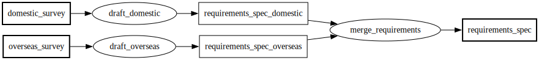
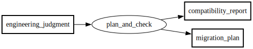
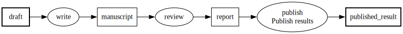
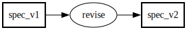
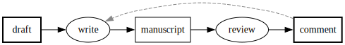
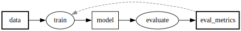
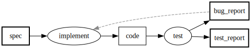

# グラフに入れた制約、入れなかった機能（PFDSL 連載 第2部）

## 図の構造に課す検査の選び方

第1部で、成果物依存グラフはテキストの処理系に載り、変更はdiffになってCIを通るようになった。
この部で扱うのは、その処理系に何を検査させるかという判断そのものである。
グラフの構造に対する制約として何を課し、何を課さなかったかを決める必要がある。

成果物の数が増えると、同じ成果物を二つのプロセスが生成している、依存のつながりが途中で切れている、参照されなくなった宣言が残っている、といった構造上の見落としが起きる。
これらは図を端から端まで目で追う列挙的な確認でしか見つからない。
列挙的な確認は人の注意力に依存する作業であり、成果物の数が増えるほど精度が落ちる。

## 機械に任せる三つの構造検査

機械に確認を任せるには、確認できる形で書かれている必要がある。
PFDSLは、出力である成果物を、ファイルや文書のように保管し検証できる有形なものに限る規則を持つ。
入力側はレビュアーの知識のように不定形なものを許す。
「理解した」は成果物にならないため、理解した内容をまとめた資料に置き換えて書く。
出力が有形であれば、完了したかどうかを判定でき、進行状況を管理できる。
その先で機械検査の対象にもなる。

成果物をどの粒度で切るか、どう名付けるか、理解をどう資料に外化するかは、人が決める設計判断である。
一方、書かれた図が決めたルールに実際に従っているかを漏れなく確認する作業は、機械に任せる。
グラフの構造に対して機械が検査するのは、次の三点である。

まず**単一生成元**の検査である。
第1部の対比デモは、この違反をGraphvizなら素通りしてしまうことを示した。
同じ成果物を複数のプロセスが生成しているとき、グラフはどちらを正とすべきかを決められない。
名前が衝突しているだけで、実体は別の文書だったという場合も多い。

要件仕様書の起草を、国内チームと海外チームがそれぞれ別のプロセスとして書いたとしよう。

<!-- pfdsl-nocheck -->
```pfdsl
domestic_survey >> draft_by_domestic_team -> requirements_spec
overseas_survey >> draft_by_overseas_team -> requirements_spec
```

checkを実行すると、次のように弾かれる。

```
$ pfdsl check requirements.pfdsl
requirements.pfdsl:1:1: error [V001]: 'requirements_spec' generated by multiple processes: draft_by_domestic_team, draft_by_overseas_team
```

実際には両チームが別々の観点から書いた別の文書であり、統合の手前で名前が衝突していただけだった。
成果物名を分け、二つを合わせるプロセスを別に立てると、衝突は解消する。

```pfdsl
domestic_survey >> draft_domestic -> requirements_spec_domestic
overseas_survey >> draft_overseas -> requirements_spec_overseas
[requirements_spec_domestic, requirements_spec_overseas] >> merge_requirements -> requirements_spec
```

```
OK
```



次に**循環の禁止**である。
循環があると、どのプロセスから着手できるかを導出できない。

移行計画の妥当性を確認するには互換性チェックが要る。
一方、互換性チェックをするには移行計画が要る。
これをそのまま図にしたとしよう。

<!-- pfdsl-nocheck -->
```pfdsl
migration_plan >> check_compat -> compatibility_report
compatibility_report >> draft_plan -> migration_plan
```

```
$ pfdsl check migration.pfdsl
migration.pfdsl:1:1: error [V010]: Primary graph contains a cycle involving 'draft_plan' → 'migration_plan'
```

移行計画と互換性チェックが互いを入力として要求し合っており、どちらから着手すればよいかが決まらない。
この場合、両者は独立した二つの作業ではなく、一つの判断が二つの成果物として出てくる相互依存だったと考えるほうが正確である。
エンジニアの判断という不定形な入力から、計画と互換性チェックを同時に出す一つのプロセスにまとめると、循環は消える。

```pfdsl
engineering_judgment >> plan_and_check -> [migration_plan, compatibility_report]
```

```
OK
```



最後に**孤立プロセスの排除**である。
一続きの依存を削除したとき、宣言だけが残ったプロセスは見た目では気づきにくい。
エッジを持たないノードは、図の面積をほとんど変えないからである。

公開作業を担当するプロセスを図に宣言したものの、その手前の成果物からのエッジを書き忘れたとしよう。

<!-- pfdsl-nocheck -->
```pfdsl
---
process:
  publish:
    label: 公開
---
draft >> write -> manuscript
manuscript >> review -> report
```

```
$ pfdsl check publish.pfdsl
publish.pfdsl:1:1: error [V020]: Process 'publish' is declared but has no edges (orphaned process)
```

エラーの内容は、宣言はあるのにどのエッジにも参加していないことである。
実装が抜けているのではなく、レビュー結果を公開につなぐエッジそのものが書かれていない。
欠けていたエッジを補うと解消する。

```pfdsl
---
process:
  publish:
    label: 公開
---
draft >> write -> manuscript
manuscript >> review -> report
report >> publish -> published_result
```

```
OK
```



この三つの検査が回っている図を、経緯を知らないレビュアーの構造レビューにかけるとどうなるか。
単一生成元、循環、孤立プロセスという検査済みの型の欠陥は出ず、指摘は検査の届かない記述、たとえば配布手順の説明文のような散文に集中する。
これは偶然ではない。
検査済みの型の欠陥は、コミットのたびに弾かれていて、レビューの時点ではもう残っていないからだ。

検査の外側に残るものは、散文だけではない。
成果物の粒度の判断も検査では守られず、見誤ることはある。

同じ入力から作られる二つの資料の作成を、一つのプロセスに統合したとしよう。
「入力の集合が同じプロセスは統合する」という粒度の規則に従った、筋の通った判断である。
ところが、統合した作業を経緯を知らない別の担い手（たとえばAI）に委譲すると、片方の資料だけが、渡していない情報を前提にした内容になって返ってくる。
その資料の作成には、図に書かれていない入力がもう一つあったことが、この失敗で初めて分かる。
統合したプロセスの中には、入力の異なる独立のプロセスが隠れていた。

図があらかじめ正しい分割を示していたわけではなく、委譲の失敗が入力の不足を明らかにした。
粒度の判断は、実際に運用してみて初めて更新される。

## 採用しなかった三つの機能

元のPFDにあるのにPFDSLにない機能、あれば便利なのに入っていない機能がある。
どれも、うっかり落としたのではなく、判断して外した。

最初に採らないのはupdateである。
元のPFDには、既存の成果物を書き換えるupdateがある。
PFDSLはこれを持たない。
データベースや本番環境、学習済みモデルのような書き換わっていく資源は、ある時点のスナップショットとして書く。
たとえば日次のダンプ、リリース版、ある時点のモデルの重みである。
更新後の自分を自分の入力にすると循環が生まれ、依存グラフから着手順序を導出できなくなる。

改版そのものは三つの形に分けて書く。
三つのうち後の二つの形では、下流の成果物から上流のプロセスへ戻る**フィードバックの辺**（`>>?`）を使う。
フィードバックの辺は、繰り返しが存在することを読み手に伝える注記であり、着手可能集合の導出では無視される。
繰り返しを実際に駆動するのは図ではなく、図を読んで作業を回す側の手順である。

一つ目は**別成果物形態**である。
版が承認や配布のベースラインになるなら、別の成果物として書く。

```pfdsl
spec_v1 >> revise -> spec_v2
```



二つ目は**収束ループ形態**である。
同じ工程の中で収束するまで繰り返す作業は、フィードバックの辺で書く。

```pfdsl
draft >> write -> manuscript
manuscript >> review -> comment
comment >>? write
```



循環の検査で見た移行計画の例をこの形で書かないのは、あれが二つの工程の反復ではなく、一つの判断の二つの出力だったからである。

三つ目は**定常サイクル形態**である。
版を数え上げられない無限の繰り返し、たとえばモデルの再学習も同じ記法で書き、性質はコメントで補う。

```pfdsl
# 終わりのない再学習サイクル。dataの版は列挙しない
data >> train -> model
model >> evaluate -> eval_metrics
eval_metrics >>? train
```



一つの成果物の改版について、三つの形は併用しない。
その版が何を意味するかを問えば、どれを使うべきかが決まる。

二つ目に採らないのは条件分岐である。
合格したら次へ、承認されたら次へ、と書きたくなる場面は多い。
だが分岐の行き先は実行時の判定でしか決まらず、これを許すと着手可能集合が図を読むだけでは導出できなくなる。
PFDSLではこの分岐を、成果物の定義そのものが誤っているしるしと捉える。
判定の結果そのものが成果物として書かれていないから、分岐が必要になる。
判定結果を成果物にすれば、後続のプロセスはそれを入力として受け取るだけでよく、分岐は要らなくなる。

```pfdsl
spec >> implement -> code
code >> test -> [test_report, bug_report]
test_report >> release -> released_package
bug_report >>? implement
```



テストに合格したら次へ、ではなく、テストの結果報告書を常に出力し、不具合票という空でもありうる成果物をフィードバックの辺で戻す。
後続のリリースは結果報告書を入力として受け取るだけでよく、分岐は図のどこにも現れない。
承認されたら次へ、も同様に、承認記録を成果物として作り、後続のプロセスはそれを入力として受け取る形に置き換える。
清水のPFDも元々この種の分岐を持たない。

三つ目に採らないのはサブルーチンである。
仕様書のレビュー、原稿のレビュー、翻訳のレビューと、似た形の作業が図の3箇所に現れたとき、共通のレビュー手順を1つ定義して3箇所から呼び出したくなる。
だがこの仕組みを導入すると、着手可能な集合を求めるために呼び出し先まで展開して読む必要が生まれ、図を静的に読み切れなくなる。
共通性を示したいときは、3つのプロセスに同じ横断的なラベルを付けて、同種の作業であることを示すにとどめる。

## 採否を分けた一つの基準

入れた制約と入れなかった機能は、同じ一つの基準で決まっている。
文脈を持たない読み手が、人であれ機械であれ、図を静的に読み切れることだ。
単一生成元、循環の禁止、孤立プロセスの排除は、この読み切りを壊す書き方を機械が弾くための検査である。
update、条件分岐、サブルーチンは、書く便利さと引き換えにこの読み切りそのものを壊すため、採らなかった。

ただし、ここまでの検査が届くのはグラフの構造、つまり何が何から作られるかまでである。
その成果物がいつ完了と言えるのか、実体はどこにあるのかという運用の情報は、まだ図に載っていない。
これを形式データとして図に載せる仕組みが第3部の主題である。
