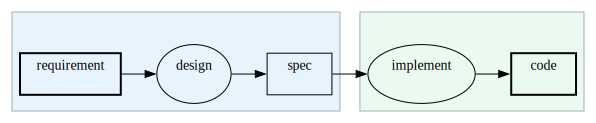

# メタデータで図を運用につなぐ（PFDSL 連載 第3部）

成果物依存グラフとstatusだけでは、運用に足りない情報がある。
ある成果物がいつ完了したと言えるのか、その実体はどこにあるのか、対応するプロセスはどう実行するのか。
これらは図の傍らに自然言語で書き添えることもできるが、書き添えた文は非形式的であり、機械には処理できない。
PFDSLはこれらをfrontmatterの形式フィールドとして持たせることで、人にもAIにも処理可能にする。
メタデータが効くのは、図を読むだけの場面ではなく、運用に必要な情報へアクセスし更新する場面である。

## 完了条件を宣言するcriteria

成果物にstatusだけを付けた図では、doneと書かれた瞬間に完了したことになる。
だが何をもって完了とするかは、書いた本人の頭の中にしかないことが多い。
後から見た担当者は、doneという文字だけでは合否を判定できない。

PFDSLは`criteria`フィールドで、成果物の完了条件を事前に宣言できる。

```pfdsl
---
artifact:
  requirement:
    label: 要件
    status: done
  spec:
    label: 仕様書
    status: done
    criteria: 要件の未解決事項がすべて解消され、2名のエンジニアがレビュー済みであること。
---
requirement >> design -> spec
```


`criteria`が書かれていれば、後続の担当者はその文言と成果物の実体を突き合わせるだけで合否を判定できる。
判定の材料が書いた人の記憶ではなく、図に埋め込まれたテキストになる。

`criteria`を書かないまま成果物を作ることもできてしまうため、PFDSLはその欠落を検査で警告する。
先の例から`criteria`を落とすと、次のように警告が出る。

```pfdsl
---
artifact:
  requirement:
    label: 要件
    status: done
  spec:
    label: 仕様書
    status: done
---
requirement >> design -> spec
```

```
demo1.pfdsl:6:3: warning [W002]: Artifact 'spec' has no 'criteria' field
```

この警告が、最初は完了済みの成果物だけを対象にしていたとする。
あるとき、検査の対象を作業中の成果物にまで広げたとしよう。
すると、規則を決めた本人が管理している図からも、完了条件の書き忘れが何件も見つかる。
規則を知っていることと、規則をすべての成果物に適用しきれていることは別なのだ。
その差は、検査の対象を広げた瞬間に露出する。

このとき、別の型の矛盾が一緒に見つかることもある。
完了条件を書き忘れていた成果物に依存する別の成果物のほうは、すでに完了扱いになっているのだ。
未完成の入力に依存する成果物を、完了と呼んでよいのだろうか。
この問いは、検査の対象を広げる前には誰にも見えていなかった。
見えてしまえば、これも検査に載る型である。
現在は、入力が完了していないのに出力だけがdoneになっている組を、検査が警告として列挙する。

ただし、この検査が保証するのはフィールドが存在することだけであり、書かれた文言の質までは検査できない。
「レビューを通過すること」とだけ書かれた完了条件は、フィールドとしては存在するため警告を免れる。
だが何を確認すればレビューを通過したと言えるのかが書かれていなければ、後から読む担当者にとっての価値は乏しい。
機械検査は欠落を防ぐが、書かれた内容が形骸化することまでは防げない。

## 図と実体をつなぐlocationとcommand

成果物やプロセスは図の上では抽象的なノードにすぎない。
実際に手を動かすには、そのノードが指す実体、たとえばリポジトリ内のファイルやissue、実行すべきコマンドにたどり着く必要がある。

`location`は成果物の実体ファイルや、プロセスの追跡文脈（issueやPR）へのポインタである。
`command`はプロセスに対応する実行可能なコマンド文字列である。

```pfdsl
---
artifact:
  spec:
    label: 仕様書
    location: docs/spec/spec.md
process:
  implement:
    label: 実装
    command: pnpm build
---
spec >> implement -> code
```


どちらもグラフの意味論には影響しない。
着手可能集合の計算はこれらのフィールドの有無に左右されない。
影響するのは道具の側であり、図が実体への索引として機能するようになる。

## ノードを束ねるtagとgroup

第2部でサブルーチンを採らなかったとき、共通性は横断的なラベルで示すにとどめた。
そのラベルの正体が`tag`である。
同種のプロセスに同じtagを付けると、図のあちこちに散らばる作業を、構造を変えずに束ねられる。

ノードを束ねるフィールドはもう一つある。
`group`はノードを工程のまとまりに所属させ、描画では同じ枠と色で束ねる。

```pfdsl
---
group:
  planning:
    label: 企画
    color: "#e8f4fd"
  delivery:
    label: 実装と公開
    color: "#eafaf1"
artifact:
  requirement:
    label: 要件
    group: planning
  spec:
    label: 仕様書
    group: planning
  code:
    label: コード
    group: delivery
process:
  design:
    label: 設計
    group: planning
  implement:
    label: 実装
    group: delivery
---
requirement >> design -> spec
spec >> implement -> code
```



そして、フィールドの集合は固定ではない。
検査は未知のフィールドを拒まないため、自分の運用に必要な属性を足せる。
たとえば見積もりのフィールドを足せば、依存グラフに沿って所要時間の合計や最長経路を計算する道具が書ける。
座標のフィールドを足せば、自動レイアウトの代わりに自由配置で描画するバックエンドとも連携できる。
どちらもまだ構想だが、メタデータが形式のあるテキストだからこそ、図を壊さずにこの種の道具を後付けできる。

## メタデータを読んで動く道具

frontmatterのフィールドが形式化されているからこそ、道具はそれを読んで動作を変えられる。
PFDSL用のVSCode拡張はこの上に構築されている。

エディタでノードにカーソルを合わせるとlabelやstatusがホバー表示され、`location`はリンクとして解釈されて実体ファイルへクリックひとつで跳べる。
編集中の内容はリアルタイムで検査され、ライブプレビュー（SVG）が横に追随する。
`.dot`や`.svg`への書き出しもある。

この拡張の中心機能は、双方向のジャンプである。
プレビュー上のノードをクリックすると、エディタの対応するエッジへ移動する。
続けてクリックすると、今度はそのノードのfrontmatter定義へトグルで切り替わる。
逆方向も動く。
エディタ側でカーソルを移動させると、プレビューは対応するノードへフォーカスを移す。

この往復が意味を持つのは、グラフィカルなエディタが持つ一覧性と、テキストエディタが持つ編集力とdiff可能性のどちらも失わずに済むからだ。
図としての見晴らしはグラフィカルな表示でしか得られないが、PFDSLの実体はテキストのままであり、第1部で見た通りgitの差分としてレビューやCIに載る。
双方向ジャンプは、この二つの利点を同じ画面の上で行き来させる仕組みである。

## frontmatterに書けない情報の置き場

frontmatterのフィールドは、どれも個々のノードに紐づく属性である。
そのため、ノードをまたぐ規約、図そのものの編集規則、図の外にある一次情報との関係には、書く場所がない。

役割分担はこうなる。
frontmatterは個々のノードに紐づく形式データに限る。
ノードを横断する規約、図のメンテナンス規則そのもの、図の外との接続に関する記述は、図の隣に置く自由記述のファイルが担う。

実際にあり得る3つの例で見る。

進行の確定に関するタイミング規約を考える。
「あるissueをクローズしたと確定させ、進捗を確定させるのはpull requestがmainにマージされた時点であり、pull requestを作った時点ではまだ確定させない」という規約は、特定の1ノードの属性ではない。
図に含まれる全ノードに横断して効く運用ルールであり、どのノードのfrontmatterに書いても他のノードには効かない。
これは図の隣の自由記述ファイルに書くしかない。

図の編集自体に関する規則も同様である。
「新しい成果物を図に追加したら、それを公開までつなぐエッジも同じ変更で足す」という規則を考える。
これを怠ると、追加した成果物が公開までつながる依存の列から切れたまま残る。
この規則は図をどう保守するかについての規則であり、図の中のどのノードのfrontmatterにも置き場所がない。

外部の一次情報との同期手段の宣言も同じ位置に置く。
issueの管理をどのサービスに委ねるか。
そのサービスとグラフの食い違いを、どの監査スクリプトで検出するか。
これらの宣言は図そのものではなく図の運用に関する情報であり、自由記述のファイルに書く。

この置き場所として、PFDSLの運用では、図のファイルと同名のMarkdownファイルを隣に対で置く慣習（roadmap.pfdslの隣にroadmap.md）を試している。
同名で対にしておけば、図を読んだ人や道具が、対応する自由記述を探さずに見つけられる。
うまく機能しそうだという仮説の段階であり、確立した規約ではない。

## 運用の情報の入口としての図

グラフとstatusに足りなかった運用の情報は、二つの置き場に分かれて外化された。
個々のノードに紐づく形式データ（完了条件、実体の所在、実行コマンド）はfrontmatterに載り、機械が欠落を検査し、道具が読んで図と実体を行き来させる。
ノードを横断する規約や図の保守規則は、図の隣の自由記述ファイルが持つ。
この分担によって、図は眺めるための絵ではなく、完了を判定し実体へたどり着くための索引として使えるようになる。

これで、何を作るか（グラフ）、いつ完了と言えるか（criteria）、実体はどこか（location）は外化された。
まだ外化されていないのは、その図を使ってプロジェクトをどう進めるかという運用の手順そのものである。
これが第4部の主題である。
