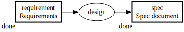
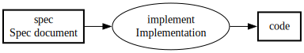

# メタデータで図を運用につなぐ（PFDSL 連載 第3部）

成果物依存グラフとstatusだけでは、運用に足りない情報がある。
ある成果物がいつ完了したと言えるのか、その実体はどこにあるのか、対応するプロセスはどう実行するのか。
これらは図の傍らに自然言語で書き添えることもできるが、書き添えた文は非形式的であり、機械には処理できない。
PFDSLはこれらをfrontmatterの形式フィールドとして持たせることで、人にもAIにも処理可能にする。
メタデータが効くのは、図を読むだけの場面ではなく、運用に必要な情報へアクセスし更新する場面である。

## criteriaで完了判定を資産にする

成果物にstatusだけを付けた図では、doneと書かれた瞬間に完了したことになる。
だが何をもって完了とするかは、書いた本人の頭の中にしかないことが多い。
後から見た担当者は、doneという文字だけでは合否を判定できない。

PFDSLは`criteria`フィールドで、成果物の完了条件を事前に宣言できる。

```pfdsl
---
artifact:
  requirement:
    label: Requirements
    status: done
  spec:
    label: Spec document
    status: done
    criteria: All open questions in requirement are resolved and reviewed by two engineers.
---
requirement >> design -> spec
```



`criteria`が書かれていれば、後続の担当者はその文言と成果物の実体を突き合わせるだけで合否を判定できる。
判定の材料が書いた人の記憶ではなく、図に埋め込まれたテキストになる。

`criteria`を書かないまま成果物を作ることもできてしまうため、PFDSLはその欠落を検査で警告する。
先の例から`criteria`を落とすと、次のように警告が出る。

```pfdsl
---
artifact:
  requirement:
    label: Requirements
    status: done
  spec:
    label: Spec document
    status: done
---
requirement >> design -> spec
```

```
demo1.pfdsl:6:3: warning [W002]: Artifact 'spec' has no 'criteria' field
```

この検査を、完了済みの成果物だけでなく作業中の成果物にも広げたとしよう。
広げた直後に、ルールを作った本人の進行管理の図へ検査をかけると、作業中の項目のうち完了条件を書き忘れているものが何件も引っかかる。
本人の図が、ルールを適用した瞬間に真っ先に指摘される側に回る。
数十件の成果物を毎回目視で照合していたわけではなく、規則を思い出せていたつもりでも実際には抜けが残っていた、ということが機械検査によって露出する。
このとき、完了条件を書き忘れていた成果物に依存する別の成果物がすでに完了扱いになっている、という矛盾が同時に見つかることもある。
未完成の入力に依存する成果物を完了と呼んでよいかは、検査の対象を広げる前には見えていなかった問いである。

ただし、この検査が保証するのはフィールドが存在することだけであり、書かれた文言の質までは検査できない。
「レビューを通過すること」とだけ書かれた完了条件は、フィールドとしては存在するため警告を免れる。
だが何を確認すればレビューを通過したと言えるのかが書かれていなければ、後から読む担当者にとっての価値は乏しい。
機械検査は欠落を防ぐが、書かれた内容が形骸化することまでは防げない。

## locationとcommandで図から実体へつなぐ

成果物やプロセスは図の上では抽象的なノードにすぎない。
実際に手を動かすには、そのノードが指す実体、たとえばリポジトリ内のファイルやissue、実行すべきコマンドにたどり着く必要がある。

`location`は成果物の実体ファイルや、プロセスの追跡文脈（issueやPR）へのポインタである。
`command`はプロセスに対応する実行可能なコマンド文字列である。

```pfdsl
---
artifact:
  spec:
    label: Spec document
    location: docs/spec/spec.md
process:
  implement:
    label: Implementation
    command: pnpm build
---
spec >> implement -> code
```



どちらもグラフの意味論には影響しない。
着手可能集合の計算はこれらのフィールドの有無に左右されない。
影響するのは道具の側であり、図が実体への索引として機能するようになる。

## メタデータを読んで動く道具

frontmatterのフィールドが形式化されているからこそ、道具はそれを読んで動作を変えられる。
PFDSL用のVSCode拡張はこの上に構築されている。

エディタでノードにカーソルを合わせると、labelやstatusといったメタデータがホバー表示される。
`location`はリンクとして解釈され、図のノードから実体ファイルへクリックひとつで移動できる。
編集中の内容はリアルタイムで検査され、編集に追随するライブプレビュー（SVG）が横に表示される。
図は`.dot`や`.svg`へも書き出せる。

この拡張の中心機能は、双方向のジャンプである。
プレビュー上のノードをクリックすると、エディタの対応するエッジへ移動する。
続けてクリックすると、今度はそのノードのfrontmatter定義へトグルで切り替わる。
逆方向も動く。
エディタ側でカーソルを移動させると、プレビューは対応するノードへフォーカスを移す。

この往復が意味を持つのは、グラフィカルなエディタが持つ一覧性と、テキストエディタが持つ編集力とdiff可能性のどちらも失わずに済むからだ。
図としての見晴らしはグラフィカルな表示でしか得られないが、PFDSLの実体はテキストのままであり、第1部で見た通りgitの差分としてレビューやCIに載る。
双方向ジャンプは、この二つの利点を同じ画面の上で行き来させる仕組みである。

## frontmatterに書けない情報の置き場

frontmatterのフィールドは、どれも個々のノードに紐づく属性である。
この制約は、ノードをまたぐ規約や、図そのものの編集規則、図の外にある一次情報との関係を書く場所を持たないことを意味する。
メタデータだけで運用が回るように見せかけると、こうした情報を書く場所を失う。

役割分担はこうなる。
frontmatterは個々のノードに紐づく形式データに限る。
ノードを横断する規約、図のメンテナンス規則そのもの、図の外との接続に関する記述は、図の隣に置く自由記述のファイルが担う。

実際にあり得る3つの例で見る。

進行の確定に関するタイミング規約を考える。
「あるissueをクローズしたと確定させ、進捗を確定させるのはpull requestがmainにマージされた時点であり、pull requestを作った時点ではまだ確定させない」という規約は、特定の1ノードの属性ではない。
図に含まれる全ノードに横断して効く運用ルールであり、どのノードのfrontmatterに書いても他のノードには効かない。
これは図の隣の自由記述ファイルに書くしかない。

図の編集自体に関する規則も同様である。
「新しい成果物を図に追加したら、それを公開までつなぐエッジも同じ変更で足す」という規則を考える。
これを怠ると、追加した成果物が公開のチェーンから切れたまま残り、気づかれずに放置される。
この規則は図をどう保守するかについての規則であり、図の中のどのノードのfrontmatterにも置き場所がない。

外部の一次情報との同期手段の宣言も同じ位置に置く。
issueの管理をどのサービスに委ねるか、そのサービスとグラフの間の食い違いをどの監査スクリプトで検出するか、といった宣言は、図そのものではなく図の運用に関する情報であり、自由記述のファイルに書く。

三つに共通するのは、いずれも1ノードの属性として書けないという一点である。
frontmatterをノード単位の属性に限定したことの裏返しとして、こうした情報の置き場所が別に要る。

## 図が運用の情報への入口になる

グラフとstatusに足りなかった運用の情報は、二つの置き場に分かれて外化された。
個々のノードに紐づく形式データ（完了条件、実体の所在、実行コマンド）はfrontmatterに載り、機械が欠落を検査し、道具が読んで図と実体を行き来させる。
ノードを横断する規約や図の保守規則は、図の隣の自由記述ファイルが持つ。
この分担によって、図は眺めるための絵ではなく、完了を判定し実体へたどり着くための索引として使えるようになる。

これで、何を作るか（グラフ）、いつ完了と言えるか（criteria）、実体はどこか（location）は外化された。
まだ外化されていないのは、その図を使ってプロジェクトをどう進めるかという運用の手順そのものである。
これが第4部の主題である。
