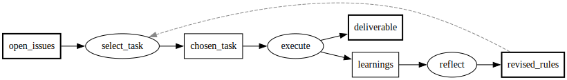

# 運用を外化して自己改善ループを回す（PFDSL 連載 第4部）

図とメタデータで、何を作るか、いつ完了と言えるかは外化された。
それでも、プロジェクトをどう進めるかという運用の知識は、まだ人の頭の中に残っている。
この部では、進行の回し方そのものをテキストに外化し、エージェントが繰り返し回せるループに載せる。
そのうえで、外化した規定を実行と振り返りで直し続ける仕組みまでを扱う。

## 毎回同じ説明をやり直す

AIエージェントに作業を任せるとき、新しい参加者を迎えるとき、そのつど同じ説明をする。
プロジェクトが今どこまで進んでいて、次に何をすべきで、この場ではどう進めるのかという内容だ。
説明は口頭かチャットのやり取りに残るだけで、次に別の相手を迎えるときにはもう一度繰り返す。

説明では、テストをどう回すか、issueをいつ閉じるかといった細部まで拾いきれないことが多い。
こうした慣習は文章になっておらず、それまでの参加者の頭の中にしか残っていない。
初めて参加する側には見えないため、慣習を破って指摘を受けるか、慣習に気づかないまま遠回りするかのどちらかになる。

プロジェクトの進め方が人の頭の中にしかない限り、参加のコストは人数と回数に比例する。
人間の新規参加者なら一度覚えた慣習は次回に持ち越されるが、AIエージェントはセッションが終わると説明の内容を保持しない。
呼び出すたびに、同じ説明を最初からやり直すことになる。

## 答える問いで分かれる3種類の図

この繰り返しをなくすには、プロジェクトの運用そのものを外化する。
何を作り何に依存するかだけでなく、進行をどう回すかまでテキストに書き、機械が読める形にする。

外化する図は、答える問いによって3種類に分かれる。

- **roadmap**：何を何の前に作るか、今何に着手できるかを表す図。成果物がstatusを持ち、着手可能集合の導出対象になる。
- **workflow**：この作業がどう繰り返されるかを表す図。誰が（人であれAIであれ）何をトリガーに何を行うかという、定常サイクルを書く。
- **runtime-pipeline**：システムが動くとき、データが何に変換されるかを表す図。

この分類は最初から設計されたものではなく、複数の仮想プロジェクトの設計を横断的に審査した結果から帰納された[^1]。

roadmapは、第1部から見てきたstatus付きの依存グラフそのものである。
workflowはたとえば次の形になる。

```pfdsl
---
type: workflow
---
open_issues >> select_task -> chosen_task
chosen_task >> execute -> [deliverable, learnings]
learnings >> reflect -> revised_rules
revised_rules >>? select_task
```



開いている作業から1つ選び、実行して成果物と知見を得て、知見を規定の改訂に反映してから、次の選択に戻る。
繰り返しは、第2部で見た定常サイクル形態のフィードバックの辺（`>>?`）で表す。
この図には担当者の名前も特定のリポジトリの事情も書かれていないため、担い手が人からAIに変わっても、この記述自体は書き換えなくてよい。

runtime-pipelineは、作業の進行ではなくデータの変換を書く。
たとえばPFDSLの処理系自身がこの種の図で管理されている。
ソースファイルが構文木になり、正準化されたグラフになり、そこから診断結果や描画が出る、という変換の連なりである。
プロジェクトの進行管理には使わないため本連載での出番は少ないが、変換の境界がどこにあるかを確認しながら実装するときに効く。

roadmapは今どこにいるかを示し、workflowは次にどう動くかを示す。
roadmapだけでは着手可能な作業は分かっても、それをどう進めるかの手順が分からない。
workflowだけでは手順は分かっても、今どの成果物が完了していて何が着手可能かが分からない。
片方が欠けると、結局どこかで人に聞くしかなくなる。

## 機械の導出とAIの判断で1サイクルを回す

roadmapとworkflowは、リポジトリに依存しない汎用のスキル（AIエージェント向けの再利用可能な手順書）が読んで回す。
PFDSLのリポジトリでは`pfd-cycle`、`pfd-ops`、`pfd-retro`という名前の手順書として公開されている。
以降はこの手順書群を**運用ハーネス**と呼ぶ。

運用ハーネスは二つの層に分かれる。
汎用の手順はPFDの概念だけから導ける。
着手の判断は「入力が全てdone」で下す。
進捗はstatusの更新で報告する。
1サイクルでは1プロセスだけを進める。
これらはグラフの意味論だけで決まるため、どのリポジトリでも同じ手順書がそのまま使える。
一方、リポジトリ固有の中身、たとえばテストの回し方やビルドのコマンドは図に書かず、図の隣に置く説明ファイルに逃がす。
手順書がこの説明ファイルを参照する形にすることで、手順書自体を書き換えずに新しいリポジトリへ持ち込める。
固有層のうち、issueを切るかどうか、いつ閉じるかといった管理の流儀は、リポジトリごとに書き起こすのではなく、選んで載せるプリセットとして扱う。
プリセットを差し替えれば、同じ運用ハーネスが別の流儀のリポジトリでも動く。

運用ハーネスが回す1サイクルは、選択、実行、反映、報告の4段階からなる。
各段階には、決定論的に導出できる作業と、文脈を読んで決める作業が混ざっている。
前者には専用のコマンドがあり、AIは後者だけを担う。
分業の全体は次の形になる。

| 段階 | 機械が返すもの | AIが判断するもの |
|---|---|---|
| 選択 | 着手可能集合と推薦（`ready --best`） | 一次情報の解釈、設計が確定しているかの見極め |
| 実行 | 構造の検査（`check`） | 作業そのもの（コードと文書の作成） |
| 反映 | 解放されたプロセスの列挙（`status-set`）、終端の監査（`check --audit`）、図間の突合（`audit-sync`） | 知見の振り分け、新しい成果物の追記 |
| 報告 | 更新後の着手可能集合 | 完了内容の要約 |

段階ごとに見ていく。

**選択**では、着手できる候補の列挙と推薦を機械が返す（第1部で見た`ready`である）。
AIはそれを受けて候補を1つ選び、そのプロセスの一次情報（issue本文など）を読む。
複数の実装方針が列挙されたまま選択が明記されていない作業は、設計が未確定である。
その場合は実装に入らず、先に方針を確定させる。
この見極めは文章の解釈であり、機械には任せられない。

**実行**は、コードを書き文書を起草する、作業そのものの段階である。
AIの文脈と判断力はここに使う。
範囲の規則は、1サイクルで1プロセスを進めることだ。
選んだプロセスが大きすぎると分かったら、先に分割を図に反映してから着手する。
たとえば「ドキュメント整備」として1つに見えていたプロセスが、着手してみると導入ガイドとAPIリファレンスと移行手順という独立した3つの文書を生むと分かったら、成果物を3つに割ってから1つを選び直す。
サイクルの単位が図のプロセスと一致しているので、どこまで進んだかを報告する先は常に図の上にある。

**反映**では、進捗の更新と整合の確認を行う。
進捗の更新は`status-set`コマンドが担う。
第1部の図（仕様書ができたら実装し、コードをレビューする図）で、仕様書の完成を記録してみる。

```
$ pfdsl status-set roadmap.pfdsl spec done
newly ready: implement
```

statusを書き換えると同時に、その変更で新たに解放された着手可能プロセスが返る。
statusの更新が何を着手可能にしたかを、更新した本人が頭の中で追い直す必要がない。

整合の確認では、図の構造を`check`が検査するのに加えて、`check --audit`が終端の成果物を列挙する。
別のプロジェクトの、要件から仕様書を作ったところで止まっている図にかけると、こう返る。

```
$ pfdsl check early-roadmap.pfdsl --audit
terminal artifacts: spec
external inputs: requirement
```

仕様書が終端に残っている、つまり仕様を消費する実装のプロセスがまだ図に無い、と一目で分かる。
仕様や計画のような手段の成果物は、それを使う後続があって初めて意味を持つ。
この監査は、後続を書き忘れたまま作業が完了扱いになることを防ぐ門番になる。
さらに、roadmapと他の図とのずれは`audit-sync`が突合する。
たとえば、workflowに追加した新しい成果物がroadmapに未登録のまま残っていれば、それが検出される。
一方、作業で得た知見をどの文書に振り分けるか、作業中に見つかった新しい成果物をどう図に足すかは、AIが判断する。
ビルドの新しい前提条件は図の隣の説明ファイルへ、レビューで判明した新しい文書の必要は図そのものへ、と振り分ける。

**報告**では、完了したプロセスと、それによって解放された後続プロセス、更新後の着手可能集合を報告する。
次のサイクルはこの報告文を引き継ぐ必要がない。
選択の材料は、更新後の図とstatusだけから再導出できるからだ。

この分業は、第2部で見た「設計判断は人が下し、規則への適合確認は機械に任せる」という分担の運用版である。
列挙、突合、導出は毎サイクル発生する定型作業であり、ここを機械に倒すことで、AIの限られた文脈は解釈と判断だけに使える。
このほかにも図の構造差分を出す`diff`、検査の診断コードから仕様の該当箇所を引く`explain`など、サイクルの周辺作業を受け持つコマンドが揃っている。

## ループ設計という関心

ここまで作ってきたサイクルを、コーディングエージェントの分野の議論の中に置いてみる。

コーディングエージェントの使い方に関する議論の重心は、1回ずつ指示を出すやり取りから離れつつある。
代わりに関心を集めているのは、エージェントが停止条件を満たすまで作業サイクルを繰り返す仕組み、つまりループをどう設計するかである。
Anthropicはループの始め方を公式ブログで解説しており、そこではループが起動の契機と停止条件で4種類に分類される[^loops]。

| 種類 | 起動の契機 | 停止 |
|---|---|---|
| ターンベース | 人のプロンプト | 応答の完了 |
| ゴールベース | 完了条件を添えた目標の宣言 | 条件の達成か、上限ターン数 |
| 時間ベース | 一定間隔のスケジュール | 完了かキャンセル |
| プロアクティブ | イベント | 各タスクの目標達成 |

普段のチャットのやり取りは、この分類ではターンベースのループを人力で回していることになる。
そこから先の3つが設計の対象になる。
時間ベースの典型は、数分おきに起動してCIの失敗を確認し、失敗していれば直すループである。
プロアクティブの典型は、issueの起票を契機に、再現の確認とラベル付けまでを人の介在なしで済ませるループである。
目標の達成判定や周期実行は、Claude Codeの機能としても提供されている。
この実践はコミュニティでloop engineeringとも呼ばれる[^osmani]。

呼び方はどうあれ、設計すべき要素は共通している。
何をきっかけに動くか、1周で何をするか、できたことをどう検証するか、いつ止まるかである。

このうち難所として繰り返し指摘されるのは、検証と状態の二つだ。

検証が難所になるのは、完了を機械的に判定する手段がないと、ループが実行者の完了報告をそのまま受け入れるしかなくなるからだ。
その状態では、周回だけ重ねて仕事が進んでいないことを誰も検出できない。
公式の解説も、テストの通過数のような決定論的な基準を成功条件に据えることを勧めている[^loops]。

状態が難所になるのは、エージェントがセッションの終わりで作業の記憶を失うからだ。
周回のあいだで引き継ぐべき状態は、会話の中ではなく外、たとえば進捗を記録したファイルやgitの履歴に置くしかない。
長時間のエージェント運用を扱うAnthropicのエンジニアリング解説も、進捗ファイルとgit履歴による状態の外部化を設計の中心に置いている[^harness]。

この設計要素に、この部で作ってきたサイクルを対応づける。

| ループの設計要素 | 設計上の難しさ | PFDSLでの対応 |
|---|---|---|
| 1周の単位 | 検証可能な大きさに切る | 着手可能集合から1プロセス |
| 完了の判定 | 決定論的な基準を用意する | 構造は`check`が機械判定、内容は`criteria`で基準を事前宣言（第2部・第3部） |
| 状態の置き場 | セッションの外に外部化する | gitに載った図とstatus（第1部） |
| 停止条件 | 明示する | 着手可能集合が空（roadmapの場合） |

完了の判定について、一点だけ限定がある。
図の構造が壊れていないかは、`check`が決定論的に判定する。
一方、成果物の中身が完了に達しているかについて、`criteria`が与えるのは判定の材料であって、判定そのものではない。
第3部で見たとおり、機械が検査するのは`criteria`が存在することまでであり、文言と実体を突き合わせる判定は読み手が行う。
それでも、判定材料が実行前から図に宣言されていることで、完了報告は「実行者がそう言ったから」ではなく「宣言済みの基準に照らして」検証できるものになる。

状態の置き場は、先ほどの報告の段階の言い換えである。
朝一番に起動したエージェントのセッションには、前日の会話が何も残っていない。
それでも図とstatusを読めば、昨日どこまで進んだか、今日どれに着手できるかが分かる。
各周回は文脈ゼロのセッションでよく、前の周回の記憶を引き継ぐ必要がない。

停止条件が図から決まるのは、進行管理の図（roadmap）を回す場合である。
終わりのない定常サイクルを書いたworkflowには停止がなく、いつまで回すかは回す側が決める。

一方で、PFDSLはループの実行機構を持たない。
周期的な起動、達成判定のための別モデルの呼び出し、セッションの再投入は、エージェント側の機能が担う。
PFDSLが担うのは、その各周回が読む状態と判定基準を、実行に先立ってテキストとして宣言しておくことである。
ループを回す機構と、ループが読む状態の記述は別々に選べる部品であり、PFDSLは後者に徹している。

## 運用を実行すると規定の穴が見える

ただし、外化された運用は書いた通りにしか実行されない。
書き手の想定が文言から漏れていれば、その漏れごと実行される。
だからループには、まだ挙げていない要素がもう一つ要る。
回すだけでなく、回した結果からループ自体を直せることだ。

運用ハーネスを実際に動かすと、規定の穴が実行のたびに見つかる。
振り返りで規定を直し、再実行で確認する。
このループが回り始める。

運用の図と手順書だけを、事前説明なしのエージェントに渡してみるとしよう。
エージェントはstatusから着手可能集合を選び、1サイクルを回して報告まで到達する。
同時に、設計者の想定漏れが手順書の穴として表面化する。
たとえば、issueを閉じるタイミングがマージ完了前に確定してしまう規定が見つかる。
あるいは、「不要になった依存のひとつながりは図から削除する」という規定で、そのひとつながりの範囲が定義されていないために、削除した後も、そこにぶら下がっていた孤立プロセスが図に残る。
文脈を持たないエージェントは書かれていない意図を補わずに手順書をそのまま実行するため、こうした穴がそのまま結果に現れる。

振り返りでは、この2つの穴を性質の違いで分けて扱う。
issueのクローズタイミングは規定の文言を直すだけで塞げる。
第3部で見たタイミング規約（クローズと進捗の確定はマージの時点で行う）は、まさにこの改訂を経た後の姿である。
一方、孤立プロセスが残る欠陥は、文言を直しても実行者が読み落とせば再発する型だと分かる。
この型は文言でなく機械検査で塞ぐべきものとして、言語側の要件として切り出す。
規定を改訂し、同じ条件で同じ手順を再実行すると、直近に表面化した欠陥は再現しなくなる。
言語側に送られた要件はやがて機械検査として実装され、同じ型の欠陥は以後機械が検出する。
第2部で見た孤立プロセスの検査は、この経路を通って言語の検査に育った要件の実例である。

実行と振り返りを別の手順書に分けるこの形は、ループ設計で勧められる、生成する側と評価する側の分離と同じである。
実行者の自己申告に頼らず、振り返りは、あらかじめ用意した監査観点の一覧に沿って図とセッションの記録を点検する。
そして振り返りの成果は規定と検査に書き戻されるため、次の周回だけでなく、別のリポジトリで回る将来のループにも効く。
プロセスの外化がLLMエージェントの挙動を安定させるという近い現象は、他でも報告され始めている[^2]。

もっとも、運用を外化しても、規定の文言に書かれていない意図、つまり暗黙のスコープは残る。

運用ルールに「サイクル開始時にopenのものがあれば先にマージする」と書いてあったとしよう。
書いた本人は、ある種類の自動生成されたブランチのプルリクエストだけを想定していた。
しかし文言には、その適用範囲を絞る条件がない。
文脈ゼロのエージェントは文言どおりに、開いている全てのプルリクエストをマージする。
結果として意図しないプルリクエストが先にマージされ、誤りだと指摘される。

定期的な振り返りで、これは「ルールが実際に想定している適用範囲が、文言のどこにも書かれていない」という記述の不在として特定できる。
原因が個別の判断ミスではなく文言の欠落だと分かれば、文言そのものを修正できる。
この修正もまた、実行で穴が見つかり、振り返りで塞ぐという同じループの一周である。

## リポジトリを替えてもループは回る

このループは、リポジトリを替えても回る。
同じ運用ハーネスを、別のリポジトリに持ち込むとする。
そのリポジトリでは、AIが進行管理の図を新規に構築する。
図に`criteria`を書くよう検査が促すため、完了条件は後続のセッションでも合否を判定できる資産になる。

その後にスコープ変更が生じたとする。
たとえば、人の確認待ちの成果物を溜める置き場を新設する変更や、成果物の種類を1つ増やす変更だ。
どちらも、`criteria`の1行編集と、一続きの依存1本の追記だけで吸収できる。
図全体を組み直す必要がないのは、図の骨格がリポジトリ固有ではないからだ。
そしてこの持ち込みのあいだ、手順書そのものには手を入れていない。
書き換わったのは図と、図の隣に置く説明ファイルだけである。

## 文脈ゼロの参加者に何が渡ったか

連載の冒頭で、プロジェクトの進め方が暗黙知のままだと、人もAIも、毎回誰かに文脈を説明してもらわないと参加できない、と述べた。
4つの部で外化してきたものを並べる。
第1部で、何が何から作られるかが成果物依存グラフになり、着手可能集合が機械導出できるようになった。
第2部で、図の構造は静的に読み切れることを基準に検査されるようになり、第3部で、完了条件と実体の所在が図に載った。
この部で、進行の回し方そのものが図と手順書になり、その規定を実行と振り返りで直し続けるループが閉じた。
「文脈ゼロの参加者が図を読むだけで作業を選び、回し、監査できる」という冒頭の一文は、この積み重ねの上に成り立っている。

[^1]: PFDファイルの種別分類の根拠。 https://github.com/takasek/pfdsl/blob/main/docs/adr/0017-pfd-kind-taxonomy.md
[^loops]: Getting started with loops（Claude公式ブログ、2026年6月）。 https://claude.com/blog/getting-started-with-loops 検証手順のスキル化と決定論的な成功基準もここで解説される。日本語の紹介記事に https://gihyo.jp/article/2026/07/coding-agent-loop-design-with-claude-code がある。
[^osmani]: Addy Osmani, "Loop Engineering"（2026年6月）。 https://addyosmani.com/blog/loop-engineering/ 呼称はコミュニティ発である。Anthropicの公式ブログはこの呼称を使わず、「ループを設計する」という言い方で同じ実践を解説している。
[^harness]: Effective harnesses for long-running agents（Anthropic engineering）。 https://www.anthropic.com/engineering/effective-harnesses-for-long-running-agents
[^2]: Externalization in LLM Agents（arXiv:2604.08224、2026）。 https://arxiv.org/abs/2604.08224 論拠としてではなく、近い現象の傍証として付記する。
