# PFDSL Samples

Re-generate: `node scripts/gen-samples.mjs`

## 01-simple-chain — Simple chain

`>>` (artifact→process) and `->` (process→artifact).

```pfdsl
requirements >> design -> spec
```


<details>
<summary>DOT</summary>

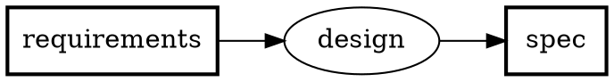

</details>

---

## 02-feedback — Feedback edge

`>>?` renders as a dashed edge with `constraint=false` — does not affect rank.

```pfdsl
spec >> implement -> code
code >> verify -> bug_report
bug_report >>? implement
```


<details>
<summary>DOT</summary>

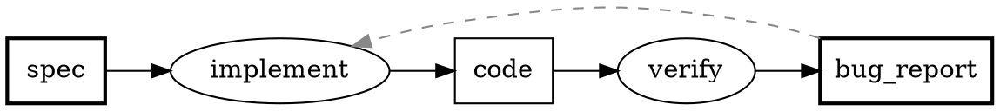

</details>

---

## 03-set-input — Set input

`[A, B] >> P` expands to two input edges.

```pfdsl
[schema, seed_data] >> migrate -> database
```


<details>
<summary>DOT</summary>

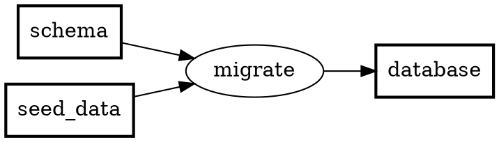

</details>

---

## 04-set-output — Set output

`P -> [A, B]` expands to two output edges.

```pfdsl
source >> build -> [binary, docs]
```


<details>
<summary>DOT</summary>

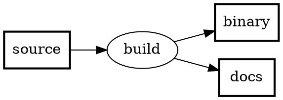

</details>

---

## 05-label-cjk — Label + CJK

`label:` sets the display name shown below the node ID. CJK labels get a computed `width=` to prevent clipping in the wasm renderer.

```pfdsl
---
artifact:
  D1: { label: 紙のアンケート }
  D2: { label: デジタルアンケート }
process:
  P1: { label: スキャン }
---
D1 >> P1 -> D2
```


<details>
<summary>DOT</summary>

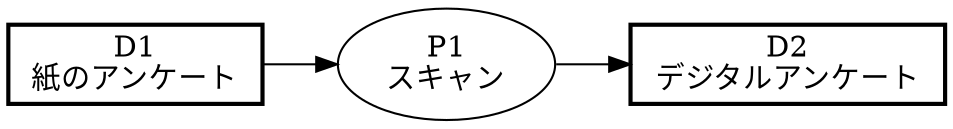

</details>

---

## 06-status-styles — Status & tag styles

`status:` + `tags:` on artifacts/processes; `statusStyles:` and the `tag:` block (label / description / style) apply DOT attributes. Multiple tags merge; `status` wins conflicts.

```pfdsl
---
artifact:
  raw_data:  { tags: [external, sensitive] }
  spec:      { status: wip }
  processed: { status: done, tags: [external] }
  report:    { status: todo, tags: [external] }
statusStyles:
  done: { fillcolor: "#d4edda", style: filled }
  wip:  { fillcolor: "#fff3cd", style: filled }
  todo: { fillcolor: "#f8f9fa", style: filled }
tag:
  external:
    label: Publicly Released
    description: Artifacts published or delivered externally
    style: { color: "#0066cc", penwidth: "2" }
  sensitive:
    style: { style: dashed }
---
raw_data >> ingest -> processed
spec >> analyze -> report
processed >> analyze
```


<details>
<summary>DOT</summary>

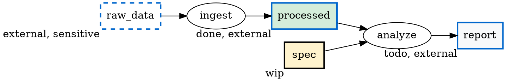

</details>

---

## 08-groups — Groups

`group:` on nodes + `group:` declarations produce `subgraph cluster_<id>` blocks.

```pfdsl
---
group:
  frontend: { label: Frontend, color: lightblue }
  backend:  { label: Backend,  color: lightyellow }
  db:       { label: DB Layer, color: "#ffd9b3", parent: backend }
artifact:
  schema:    { group: db }
  migrated:  { group: db }
  endpoint:  { group: backend }
  ui_mockup: { group: frontend }
  component: { group: frontend }
process:
  migrate:   { group: db }
  build_api: { group: backend }
  build_ui:  { group: frontend }
---
schema >> migrate -> migrated
migrated >> build_api -> endpoint
ui_mockup >> build_ui -> component
```


<details>
<summary>DOT</summary>

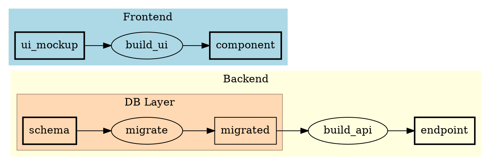

</details>

---

## 09-parts — Parts

`parts:` declares sub-artifacts of a composite artifact. Short IDs + `label:` show how opaque keys pair with human-readable names.

```pfdsl
---
artifact:
  D0: { label: Source }
  D1:
    label: Release Package
    parts: [D2, D3, D4]
  D2: { label: Binary }
  D3: { label: Config }
  D4: { label: Release Notes }
process:
  P1: { label: Build }
---
D0 >> P1 -> D1
```


<details>
<summary>DOT</summary>

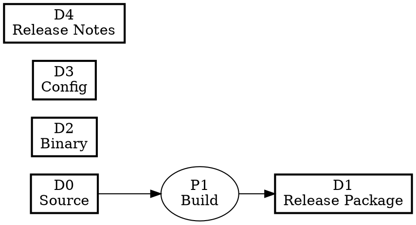

</details>

---

## 10-layout-tb — Layout direction

`layout.direction: TB` sets `rankdir=TB`. Default is `LR`.

```pfdsl
---
layout:
  direction: TB
---
requirements >> design -> spec
spec >> implement -> code
```


<details>
<summary>DOT</summary>

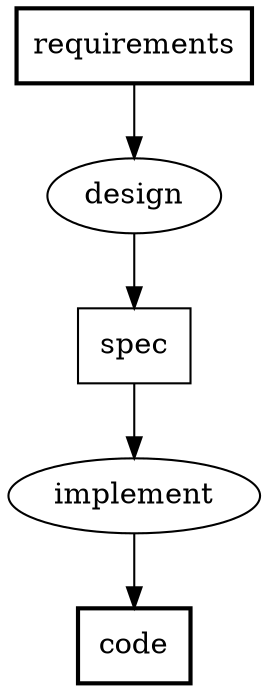

</details>

---

## 11-external-stakeholders — External stakeholders

`externalStakeholders:` on artifacts marks external consumers outside the flow graph. Excluded from orphan-terminal audit (`graph io`).

```pfdsl
---
artifact:
  raw_data:
    label: Raw Data
  report:
    label: Monthly Report
    externalStakeholders: [Regulatory Authority, Audit Firm]
  summary:
    label: Executive Summary
    externalStakeholders: [Management]
---
raw_data >> analyze -> report
report >> summarize -> summary
```

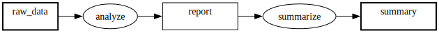

<details>
<summary>DOT</summary>

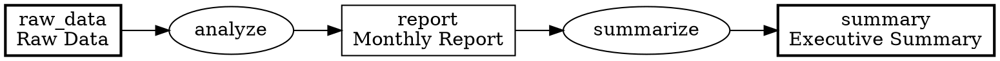

</details>

---

## 12-subflow — Subflow

`subflow:` on a process links to a child `.pfdsl` file. The child's open inputs and terminals must bijectively match the parent process's normal inputs and outputs (V034).

```pfdsl
---
artifact:
  requirement:
    label: Requirements
  shipped_order:
    label: Shipped Order
process:
  fulfill_order:
    label: Order Fulfillment
    subflow: ./12-subflow-detail.pfdsl
---
requirement >> fulfill_order -> shipped_order
```

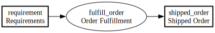

<details>
<summary>DOT</summary>

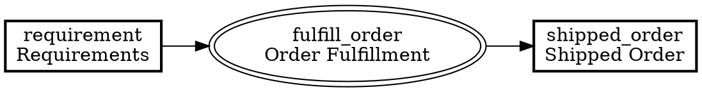

</details>

---

## 12-subflow-detail — Subflow child

The child flow referenced by `12-subflow.pfdsl`'s `subflow:` — its open input and terminal artifacts (`requirement`, `shipped_order`) bijectively match the parent process's inputs and outputs.

```pfdsl
---
artifact:
  requirement:
    label: Requirements
    description: Boundary artifact — matches parent normal input.
  picked_items:
    label: Picked Items
  packed_box:
    label: Packed Box
  shipped_order:
    label: Shipped Order
    description: Boundary artifact — matches parent output.
---
requirement >> pick_items -> picked_items
picked_items >> pack -> packed_box
packed_box >> ship -> shipped_order
```

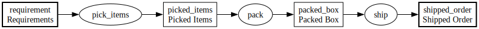

<details>
<summary>DOT</summary>

```dot
digraph PFDSL {
  rankdir=LR;
  newrank=true;

  "pack" [shape=ellipse, label="pack"];
  "packed_box" [shape=box, label="packed_box\nPacked Box"];
  "pick_items" [shape=ellipse, label="pick_items"];
  "picked_items" [shape=box, label="picked_items\nPicked Items"];
  "requirement" [shape=box, label="requirement\nRequirements", tooltip="Requirements\n\nBoundary artifact — matches parent normal input.", penwidth="2"];
  "ship" [shape=ellipse, label="ship"];
  "shipped_order" [shape=box, label="shipped_order\nShipped Order", tooltip="Shipped Order\n\nBoundary artifact — matches parent output.", penwidth="2"];

  "requirement" -> "pick_items";
  "pick_items" -> "picked_items";
  "picked_items" -> "pack";
  "pack" -> "packed_box";
  "packed_box" -> "ship";
  "ship" -> "shipped_order";
}
```

</details>

---

## 13-preset — Preset (extends)

`extends:` inherits `statusStyles` / `tag` / `group` from a preset file. Attribute-level deep merge: local values override inherited ones.

```pfdsl
---
extends: ./13-preset-base.pfdsl
artifact:
  backlog: { status: done }
  prototype: { status: wip }
  release: { status: todo }
---
backlog >> develop -> prototype
prototype >> review -> release
```

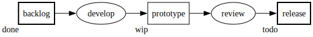

<details>
<summary>DOT</summary>

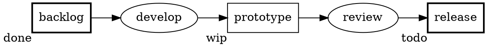

</details>

---

## 13-preset-base — Preset base

The base file referenced by `13-preset.pfdsl`'s `extends:` — declares `statusStyles` inherited by the child.

```pfdsl
---
statusStyles:
  done: { fillcolor: "#d4edda", style: filled }
  wip:  { fillcolor: "#fff3cd", style: filled }
  todo: { fillcolor: "#f8f9fa", style: filled }
---
```


<details>
<summary>DOT</summary>

```dot
digraph PFDSL {
  rankdir=LR;
  newrank=true;

}
```

</details>

---

## 14-boundary — Boundary map

`boundary:` on a subflow process remaps parent artifact IDs to different child artifact IDs. Useful when reusing an independently-named child flow.

```pfdsl
---
artifact:
  order:
    label: Customer Order
  parcel:
    label: Parcel
process:
  fulfill:
    label: Fulfillment
    subflow: ./14-boundary-detail.pfdsl
    boundary:
      order: incoming_order
      parcel: outgoing_parcel
---
order >> fulfill -> parcel
```

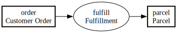

<details>
<summary>DOT</summary>

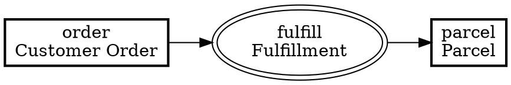

</details>

---

## 14-boundary-detail — Boundary child

The child flow referenced by `14-boundary.pfdsl`'s `subflow:` — its artifact IDs (`incoming_order`, `outgoing_parcel`) are remapped from the parent's `order` / `parcel` via `boundary:`.

```pfdsl
---
artifact:
  incoming_order:
    label: Incoming Order
    description: Boundary artifact — mapped from parent 'order' via boundary:.
  picked:
    label: Picked Items
  outgoing_parcel:
    label: Outgoing Parcel
    description: Boundary artifact — mapped from parent 'parcel' via boundary:.
---
incoming_order >> pick -> picked
picked >> pack -> outgoing_parcel
```

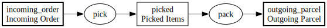

<details>
<summary>DOT</summary>


</details>

---

## 15-index — Index field

`index:` assigns an optional positive integer to artifacts and processes (independent namespaces). No graph-semantic effect; `pfdsl meta reindex` numbers nodes in topological order.

```pfdsl
---
artifact:
  requirement: { index: 1 }
  spec:        { index: 2 }
  code:        { index: 3 }
process:
  design:      { index: 1 }
  implement:   { index: 2 }
---
requirement >> design -> spec
spec >> implement -> code
```

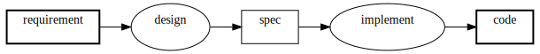

<details>
<summary>DOT</summary>

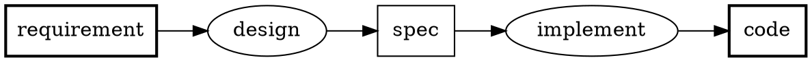

</details>

---

## 16-basepath — basePath field

`basePath:` sets the base directory for resolving `location:` file paths and `command:` working directory. Defaults to the `.pfdsl` file's directory when omitted. `location:` may also be set on processes.

```pfdsl
---
basePath: ../
process:
  build:
    command: npm run build
    label: Build
    location: https://github.com/example/repo/issues/1
artifact:
  source:
    label: Source Code
  output:
    label: Build Output
    location: dist/index.js
---
source >> build -> output
```

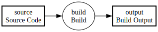

<details>
<summary>DOT</summary>

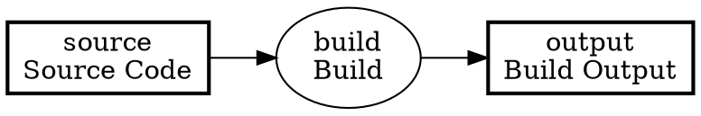

</details>

---

## 17-type — type field

`type:` declares the PFD kind (`roadmap`, `workflow`, `runtime-pipeline`). Values outside the enum cause an error (V031). `pfdsl status ready` rejects any explicit non-`roadmap` type; omitting `type:` is treated as `roadmap` and allowed, with a warning (W006).

```pfdsl
---
type: roadmap
artifact:
  requirements:
    label: Requirements
    status: done
  implementation:
    label: Implementation
    status: wip
process:
  build:
    label: Build
---
requirements >> build -> implementation
```

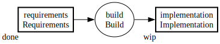

<details>
<summary>DOT</summary>

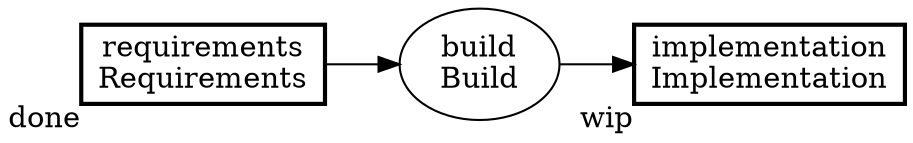

</details>

---

## pfdsl_implementation_flow — PFDSL toolchain roadmap

How PFDSL itself was built — a snapshot of the toolchain implementation flow, written in PFDSL (dogfooding).

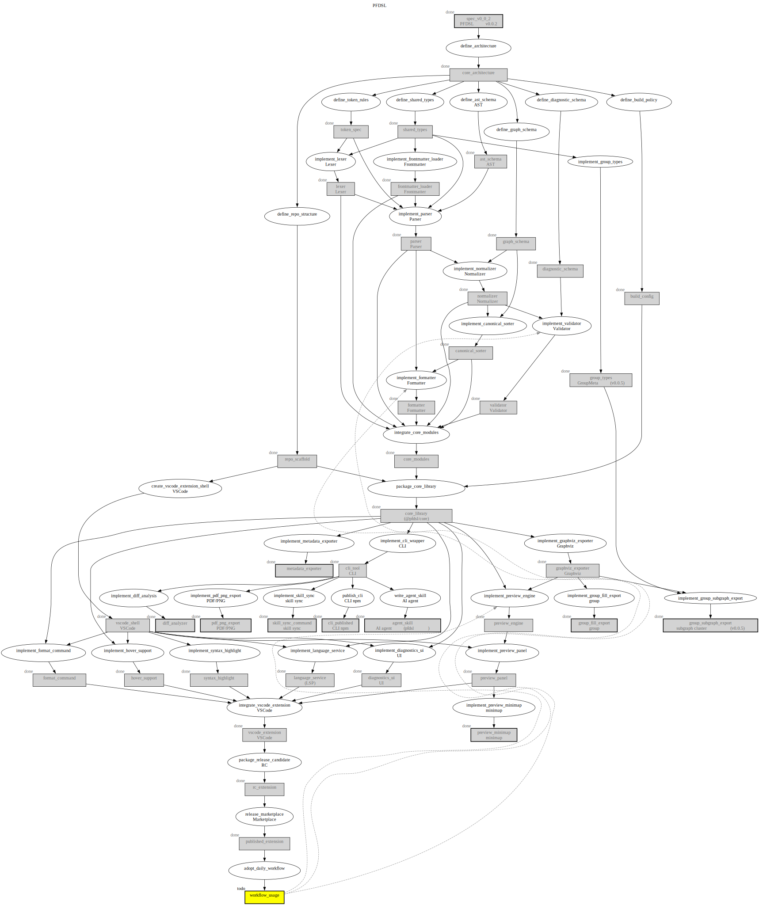

[Source](pfdsl_implementation_flow.pfdsl) · [DOT](pfdsl_implementation_flow.dot)

---

