# PFDSL Samples

Re-generate: `node scripts/gen-samples.mjs`

## 01-simple-chain — Simple chain

`>>` (artifact→process) and `->` (process→artifact).

```pfdsl
requirements >> design -> spec
```


<details>
<summary>DOT</summary>

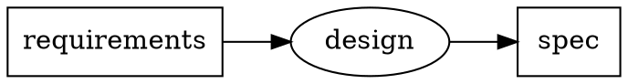

</details>

---

## 02-feedback — Feedback edge

`>>?` renders as a dashed edge with `constraint=false` — does not affect rank.

```pfdsl
spec >> implement -> code
code >> verify -> bug_report
bug_report >>? implement
```


<details>
<summary>DOT</summary>

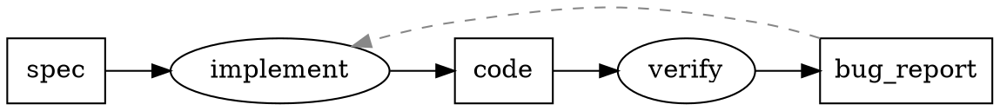

</details>

---

## 03-set-input — Set input

`[A, B] >> P` expands to two input edges.

```pfdsl
[schema, seed_data] >> migrate -> database
```


<details>
<summary>DOT</summary>

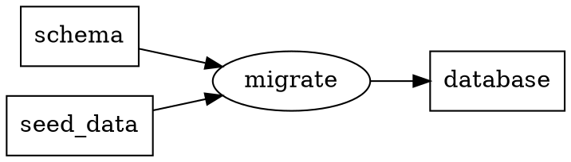

</details>

---

## 04-set-output — Set output

`P -> [A, B]` expands to two output edges.

```pfdsl
source >> build -> [binary, docs]
```


<details>
<summary>DOT</summary>

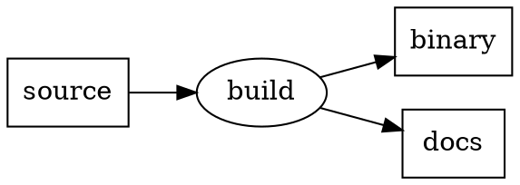

</details>

---

## 05-label-cjk — Label + CJK

`label:` sets the display name shown below the node ID. CJK labels get a computed `width=` to prevent clipping in the wasm renderer.

```pfdsl
---
artifact:
  D1: { label: 紙のアンケート }
  D2: { label: デジタルアンケート }
process:
  P1: { label: スキャン }
---
D1 >> P1 -> D2
```


<details>
<summary>DOT</summary>

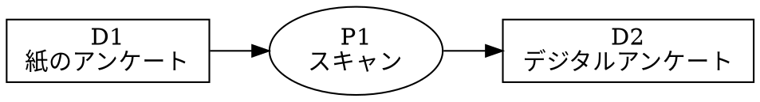

</details>

---

## 06-status-styles — Status styles

`status:` on artifacts + `statusStyles:` maps status values to DOT node attributes.

```pfdsl
---
artifact:
  requirements: { status: done }
  spec:         { status: wip }
  code:         { status: todo }
statusStyles:
  done: { fillcolor: "#d4edda", style: filled }
  wip:  { fillcolor: "#fff3cd", style: filled }
  todo: { fillcolor: "#f8f9fa", style: filled }
---
requirements >> design -> spec
spec >> implement -> code
```


<details>
<summary>DOT</summary>

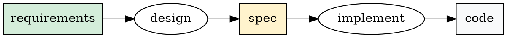

</details>

---

## 07-tag-styles — Tag styles

`tags:` on artifacts + `tagStyles:` applies DOT attributes per tag.

```pfdsl
---
artifact:
  customer_data: { tags: [external] }
  report:        { tags: [external] }
tagStyles:
  external: { color: "#0066cc", penwidth: "2" }
---
customer_data >> analyze -> report
```

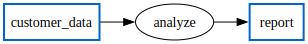

<details>
<summary>DOT</summary>

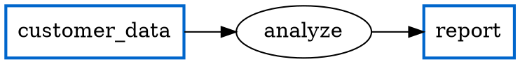

</details>

---

## 08-groups — Groups

`group:` on nodes + `group:` declarations produce `subgraph cluster_<id>` blocks.

```pfdsl
---
group:
  frontend: { label: Frontend, color: lightblue }
  backend:  { label: Backend,  color: lightyellow }
artifact:
  api_spec:  { group: backend }
  endpoint:  { group: backend }
  ui_mockup: { group: frontend }
  component: { group: frontend }
process:
  build_api: { group: backend }
  build_ui:  { group: frontend }
---
api_spec >> build_api -> endpoint
ui_mockup >> build_ui -> component
```


<details>
<summary>DOT</summary>

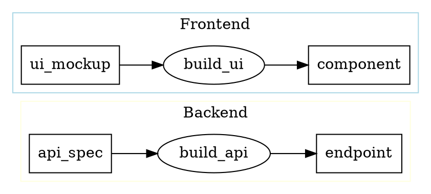

</details>

---

## 09-parts — Parts

`parts:` declares sub-artifacts of a composite artifact. Short IDs + `label:` show how opaque keys pair with human-readable names.

```pfdsl
---
artifact:
  D0: { label: Source }
  D1:
    label: Release Package
    parts: [D2, D3, D4]
  D2: { label: Binary }
  D3: { label: Config }
  D4: { label: Release Notes }
process:
  P1: { label: Build }
---
D0 >> P1 -> D1
```


<details>
<summary>DOT</summary>

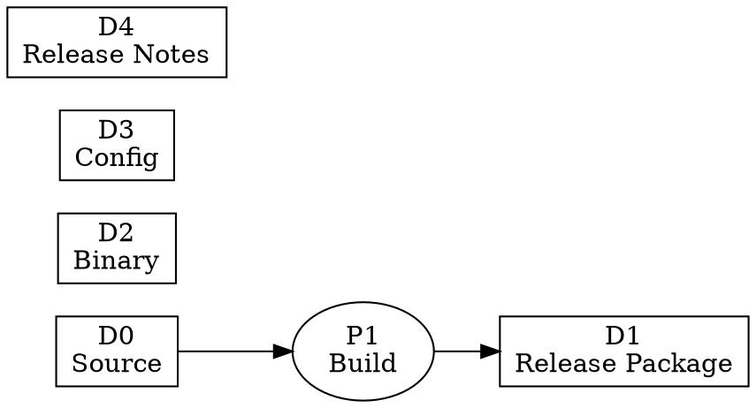

</details>

---

## 10-layout-tb — Layout direction

`layout.direction: TB` sets `rankdir=TB`. Default is `LR`.

```pfdsl
---
layout:
  direction: TB
---
requirements >> design -> spec
spec >> implement -> code
```


<details>
<summary>DOT</summary>

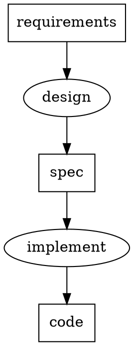

</details>

---

## Real-world example

[pfdsl_implementation_flow.pfdsl](../pfdsl_implementation_flow.pfdsl) — the PFDSL toolchain roadmap, written in PFDSL itself.


[Source](../pfdsl_implementation_flow.pfdsl) · [DOT](../pfdsl_implementation_flow.dot)
