# PFDSL Samples

Re-generate: `node scripts/gen-samples.mjs`

## 01-simple-chain — Simple chain

`>>` (artifact→process) and `->` (process→artifact).

```pfdsl
requirements >> design -> spec
```


<details>
<summary>DOT</summary>

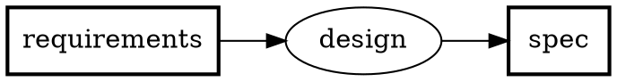

</details>

---

## 02-feedback — Feedback edge

`>>?` renders as a dashed edge with `constraint=false` — does not affect rank.

```pfdsl
spec >> implement -> code
code >> verify -> bug_report
bug_report >>? implement
```


<details>
<summary>DOT</summary>

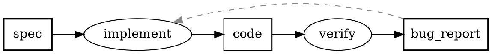

</details>

---

## 03-set-input — Set input

`[A, B] >> P` expands to two input edges.

```pfdsl
[schema, seed_data] >> migrate -> database
```


<details>
<summary>DOT</summary>

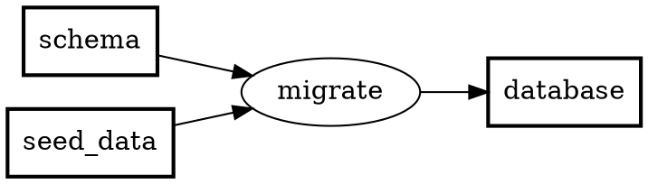

</details>

---

## 04-set-output — Set output

`P -> [A, B]` expands to two output edges.

```pfdsl
source >> build -> [binary, docs]
```


<details>
<summary>DOT</summary>

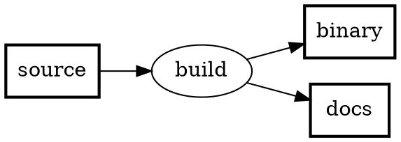

</details>

---

## 05-label-cjk — Label + CJK

`label:` sets the display name shown below the node ID. CJK labels get a computed `width=` to prevent clipping in the wasm renderer.

```pfdsl
---
artifact:
  D1: { label: 紙のアンケート }
  D2: { label: デジタルアンケート }
process:
  P1: { label: スキャン }
---
D1 >> P1 -> D2
```


<details>
<summary>DOT</summary>

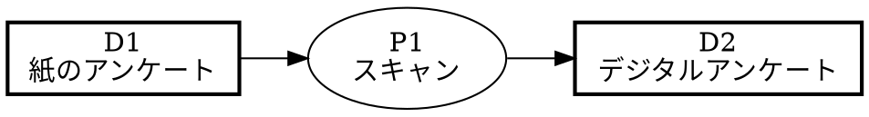

</details>

---

## 06-status-styles — Status & tag styles

`status:` + `tags:` on artifacts; `statusStyles:` and `tagStyles:` apply DOT attributes. Multiple tags merge; `status` wins conflicts.

```pfdsl
---
artifact:
  raw_data:  { tags: [external, sensitive] }
  spec:      { status: wip }
  processed: { status: done, tags: [external] }
  report:    { status: todo, tags: [external] }
statusStyles:
  done: { fillcolor: "#d4edda", style: filled }
  wip:  { fillcolor: "#fff3cd", style: filled }
  todo: { fillcolor: "#f8f9fa", style: filled }
tagStyles:
  external:  { color: "#0066cc", penwidth: "2" }
  sensitive: { style: dashed }
---
raw_data >> ingest -> processed
spec >> analyze -> report
processed >> analyze
```


<details>
<summary>DOT</summary>

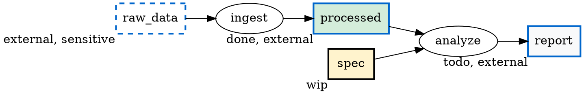

</details>

---

## 08-groups — Groups

`group:` on nodes + `group:` declarations produce `subgraph cluster_<id>` blocks.

```pfdsl
---
group:
  frontend: { label: Frontend, color: lightblue }
  backend:  { label: Backend,  color: lightyellow }
artifact:
  api_spec:  { group: backend }
  endpoint:  { group: backend }
  ui_mockup: { group: frontend }
  component: { group: frontend }
process:
  build_api: { group: backend }
  build_ui:  { group: frontend }
---
api_spec >> build_api -> endpoint
ui_mockup >> build_ui -> component
```


<details>
<summary>DOT</summary>

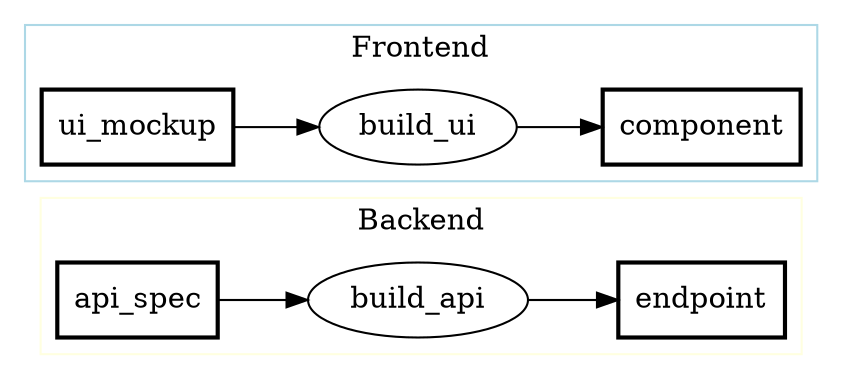

</details>

---

## 09-parts — Parts

`parts:` declares sub-artifacts of a composite artifact. Short IDs + `label:` show how opaque keys pair with human-readable names.

```pfdsl
---
artifact:
  D0: { label: Source }
  D1:
    label: Release Package
    parts: [D2, D3, D4]
  D2: { label: Binary }
  D3: { label: Config }
  D4: { label: Release Notes }
process:
  P1: { label: Build }
---
D0 >> P1 -> D1
```


<details>
<summary>DOT</summary>

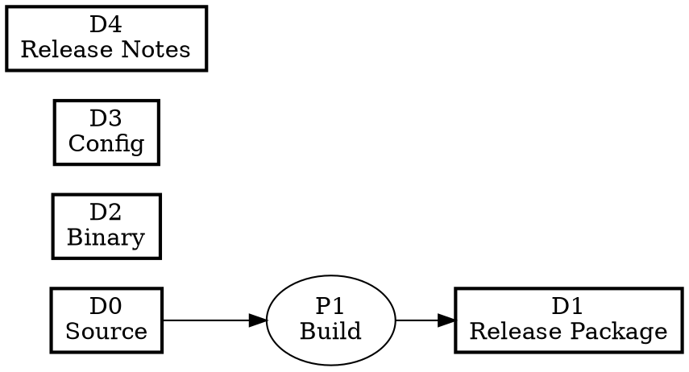

</details>

---

## 10-layout-tb — Layout direction

`layout.direction: TB` sets `rankdir=TB`. Default is `LR`.

```pfdsl
---
layout:
  direction: TB
---
requirements >> design -> spec
spec >> implement -> code
```


<details>
<summary>DOT</summary>

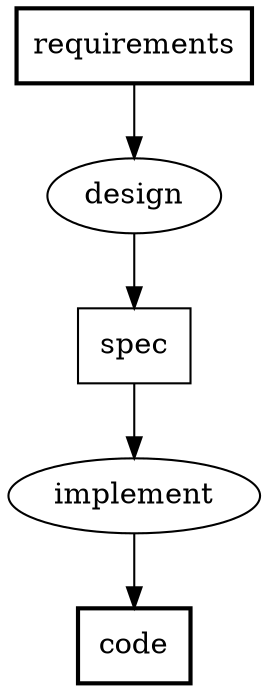

</details>

---

## 11-practical-web-dev — Practical integrated example

Real-world flow combining feedback edges, set notation, multi-output, status styling, and owner metadata. Demonstrates the quality guidelines: essential artifact in outputs, single revision pattern, no implicit dependencies. Includes an organizational learning loop (review findings feed back into checklist curation).

```pfdsl
---
title: Webアプリ機能開発フロー
layout:
  direction: LR
  maxWidth: 120

artifact:
  requirement:
    label: 要求仕様書
    status: done
    description: 機能要求・受け入れ条件を記述した仕様書
    owner: PO
  design_doc:
    label: 設計書
    status: done
    description: API設計・画面設計・DB設計を含む技術設計書
    owner: Tech Lead
  implementation:
    label: 実装コード
    status: wip
    description: プルリクエスト単位の実装差分
    owner: Dev
  review_comment:
    label: レビュー指摘票
    status: wip
    description: コードレビューで挙げられた指摘事項
    owner: Reviewer
  test_report:
    label: テスト報告書
    status: todo
    description: QAによる動作確認結果・不具合一覧
    owner: QA
  bug_ticket:
    label: バグチケット
    status: todo
    description: QA検出バグを起票したチケット
    owner: QA
  deployed_release:
    label: リリース版
    status: todo
    description: 本番環境にデプロイされた成果物
    owner: Tech Lead
  release_note:
    label: リリースノート
    status: todo
    description: 本番リリース内容の変更点まとめ
    owner: Tech Lead
  coding_standard:
    label: コーディング規約
    status: done
    description: 組織共通のコーディング規約・設計原則
  checklist:
    label: レビュー観点表
    status: done
    description: 過去の指摘を反映して整備されるレビュー観点のチェックリスト
    owner: Reviewer

process:
  design:
    label: 設計
    description: 要求仕様を読み込み技術設計書を作成する
    owner: Tech Lead
  implement:
    label: 実装
    description: 設計書に基づきコードを書きPRを作成する
    owner: Dev
  review_code:
    label: コードレビュー
    description: PRを読み指摘票を作成する
    owner: Reviewer
  qa_test:
    label: QAテスト
    description: ステージング環境で動作確認しテスト報告書を作成する
    owner: QA
  release:
    label: リリース
    description: 本番デプロイとリリースノート作成
    owner: Tech Lead
  curate_checklist:
    label: 観点表整備
    description: 規約と過去のレビュー指摘をもとに観点表を更新する
    owner: Reviewer

statusStyles:
  done:    { fillcolor: "#d4edda", style: filled }
  wip:     { fillcolor: "#fff3cd", style: filled }
  todo:    { fillcolor: "#f8f9fa", style: filled }
  blocked: { fillcolor: "#f8d7da", style: filled }
---

requirement >> design -> design_doc

design_doc >> implement -> implementation

coding_standard >> curate_checklist -> checklist

[implementation, checklist] >> review_code -> review_comment

review_comment >>? curate_checklist

review_comment >>? implement

[implementation, design_doc] >> qa_test -> [test_report, bug_ticket]

bug_ticket >>? implement

[test_report, implementation] >> release -> [deployed_release, release_note]
```

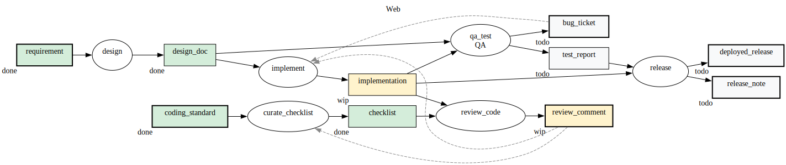

<details>
<summary>DOT</summary>

```dot
digraph PFDSL {
  rankdir=LR;
  newrank=true;
  label="Webアプリ機能開発フロー";
  labelloc="t";

  "bug_ticket" [shape=box, label="bug_ticket\nバグチケット", tooltip="バグチケット\n\nQA検出バグを起票したチケット", width=1.50, xlabel="todo", fillcolor="#f8f9fa", style="filled", penwidth="2"];
  "checklist" [shape=box, label="checklist\nレビュー観点表", tooltip="レビュー観点表\n\n過去の指摘を反映して整備されるレビュー観点のチェックリスト", width=1.70, xlabel="done", fillcolor="#d4edda", style="filled"];
  "coding_standard" [shape=box, label="coding_standard\nコーディング規約", tooltip="コーディング規約\n\n組織共通のコーディング規約・設計原則", width=1.90, xlabel="done", fillcolor="#d4edda", style="filled", penwidth="2"];
  "curate_checklist" [shape=ellipse, label="curate_checklist\n観点表整備", tooltip="観点表整備\n\n規約と過去のレビュー指摘をもとに観点表を更新する", width=1.90];
  "deployed_release" [shape=box, label="deployed_release\nリリース版", tooltip="リリース版\n\n本番環境にデプロイされた成果物", width=1.90, xlabel="todo", fillcolor="#f8f9fa", style="filled", penwidth="2"];
  "design" [shape=ellipse, label="design\n設計", tooltip="設計\n\n要求仕様を読み込み技術設計書を作成する", width=0.90];
  "design_doc" [shape=box, label="design_doc\n設計書", tooltip="設計書\n\nAPI設計・画面設計・DB設計を含む技術設計書", width=1.30, xlabel="done", fillcolor="#d4edda", style="filled"];
  "implement" [shape=ellipse, label="implement\n実装", tooltip="実装\n\n設計書に基づきコードを書きPRを作成する", width=1.20];
  "implementation" [shape=box, label="implementation\n実装コード", tooltip="実装コード\n\nプルリクエスト単位の実装差分", width=1.70, xlabel="wip", fillcolor="#fff3cd", style="filled"];
  "qa_test" [shape=ellipse, label="qa_test\nQAテスト", tooltip="QAテスト\n\nステージング環境で動作確認しテスト報告書を作成する", width=1.10];
  "release" [shape=ellipse, label="release\nリリース", tooltip="リリース\n\n本番デプロイとリリースノート作成", width=1.10];
  "release_note" [shape=box, label="release_note\nリリースノート", tooltip="リリースノート\n\n本番リリース内容の変更点まとめ", width=1.70, xlabel="todo", fillcolor="#f8f9fa", style="filled", penwidth="2"];
  "requirement" [shape=box, label="requirement\n要求仕様書", tooltip="要求仕様書\n\n機能要求・受け入れ条件を記述した仕様書", width=1.40, xlabel="done", fillcolor="#d4edda", style="filled", penwidth="2"];
  "review_code" [shape=ellipse, label="review_code\nコードレビュー", tooltip="コードレビュー\n\nPRを読み指摘票を作成する", width=1.70];
  "review_comment" [shape=box, label="review_comment\nレビュー指摘票", tooltip="レビュー指摘票\n\nコードレビューで挙げられた指摘事項", width=1.70, xlabel="wip", fillcolor="#fff3cd", style="filled", penwidth="2"];
  "test_report" [shape=box, label="test_report\nテスト報告書", tooltip="テスト報告書\n\nQAによる動作確認結果・不具合一覧", width=1.50, xlabel="todo", fillcolor="#f8f9fa", style="filled"];

  "requirement" -> "design";
  "design" -> "design_doc";
  "design_doc" -> "implement";
  "implement" -> "implementation";
  "coding_standard" -> "curate_checklist";
  "curate_checklist" -> "checklist";
  "implementation" -> "review_code";
  "checklist" -> "review_code";
  "review_code" -> "review_comment";
  "implementation" -> "qa_test";
  "design_doc" -> "qa_test";
  "qa_test" -> "test_report";
  "qa_test" -> "bug_ticket";
  "test_report" -> "release";
  "implementation" -> "release";
  "release" -> "deployed_release";
  "release" -> "release_note";
  "review_comment" -> "curate_checklist" [style=dashed, color="#888888", constraint=false];
  "review_comment" -> "implement" [style=dashed, color="#888888", constraint=false];
  "bug_ticket" -> "implement" [style=dashed, color="#888888", constraint=false];
}
```

</details>

---

## Real-world example

[pfdsl_implementation_flow.pfdsl](../pfdsl_implementation_flow.pfdsl) — the PFDSL toolchain roadmap, written in PFDSL itself.


[Source](../pfdsl_implementation_flow.pfdsl) · [DOT](../pfdsl_implementation_flow.dot)
